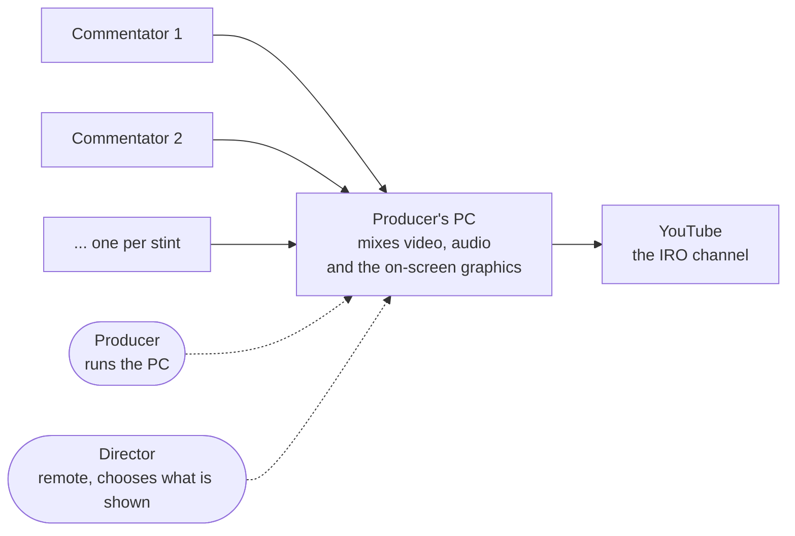
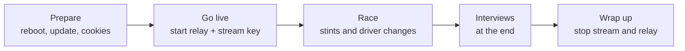
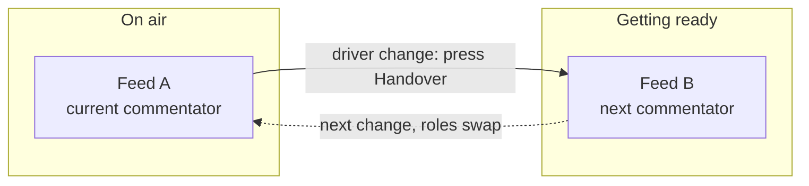
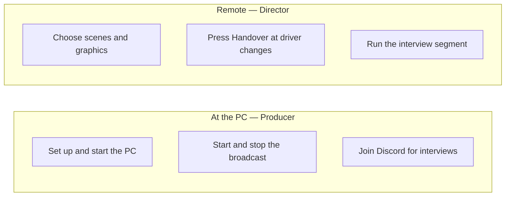

# Wiki Restructure Implementation Plan

> **For agentic workers:** REQUIRED SUB-SKILL: Use superpowers:subagent-driven-development (recommended) or superpowers:executing-plans to implement this plan task-by-task. Steps use checkbox (`- [ ]`) syntax for tracking.

**Goal:** Restructure the GitHub wiki into an operator-first guide (producer + remote director) with the existing technical depth preserved in a separated "Technical reference" chapter, add four simplified high-level diagrams, and make OS coverage (Windows/macOS/Linux) consistent.

**Architecture:** Edit only `src/docs/wiki/*.md` and `_Sidebar.md` (+ one `CLAUDE.md` line). Operator pages are rewritten simple; technical pages are retitled/cross-linked and kept. Publish with `tools/sync-wiki.py` (mirrors source → wiki, deleting renamed-away pages). Verify rendering on GitHub with Playwright.

**Tech Stack:** Markdown + Mermaid (GitHub wiki via Gollum; Mermaid renders in sandboxed `viewscreen.githubusercontent.com` iframes). No code, no tests — "verification" is render/link checks.

**Design reference:** `docs/superpowers/specs/2026-06-04-wiki-restructure-design.md`

---

## Conventions (read once, applies to every page)

**Audience voice (operator pages):** short sentences, imperative ("Open OBS, click…"), no
ports / tool internals / jargon. A producer who is not a developer must be able to follow.

**OS policy (every page, every OS-specific instruction):** name **macOS, Windows, and
Linux together** — never one alone. Templates to reuse verbatim:

- *Install tools:*
  - macOS: `brew install streamlink yt-dlp ffmpeg deno`
  - Windows: `winget install streamlink yt-dlp` + `winget install Gyan.FFmpeg DenoLand.Deno` (or `pip install -U streamlink yt-dlp`)
  - Linux: `brew install streamlink yt-dlp ffmpeg deno` or your distro packages (`apt`/`dnf`) + `pip install -U streamlink yt-dlp`
- *Update tools:* macOS/Linux `brew upgrade streamlink yt-dlp` · Windows `pip install -U streamlink yt-dlp`
- *Discord audio in OBS:*
  - macOS: **App Audio Capture** (bound to Discord; keep Discord **windowed**, grant OBS Screen & System Audio Recording)
  - Windows: **Application Audio Capture (BETA)** → pick Discord
  - Linux: **Application Audio Capture** (PipeWire) or an **Audio Output Capture** monitor source — *should work, not yet tested on Linux*
- *Cookie export quirks:* macOS Chrome/Edge → Keychain prompt, Safari → Full Disk Access; Windows/Linux → browser export, usually no extra prompt (Firefox needs none anywhere)

Any Linux specific not personally verified gets the suffix *"(should work — not yet tested on Linux)."*

**Cross-links:** operator page → "Full detail: [<Technical page>]". Technical page → "Just
running it? See [<Operator page>]." Use GitHub wiki link form `[Label](Page-File-Name)`
(no `.md`, dashes for spaces).

**Mermaid safety:** never use `;` inside a node/edge/note label (it is a statement
separator and breaks rendering). Keep labels in `"..."`. Verified by the lint in Task 13.

---

## File map (locks in the decomposition)

Renames (via `git mv`, preserves history; `sync-wiki.py` deletes the old wiki pages):

| Old file | New file | Tier |
|---|---|---|
| `Installation.md` | `Set-up-the-broadcast-PC.md` | operator |
| `Runbook.md` | `Run-an-event.md` | operator |
| `Roles.md` | `Who-does-what.md` | operator |
| `Troubleshooting.md` | `If-something-goes-wrong.md` | operator |
| `Maintaining-this-Wiki.md` | `Build-and-maintenance.md` | technical |

Kept filenames, retitled/relabelled only: `Home.md`, `Director.md` (operator);
`Architecture.md`, `Relay-Mode.md`, `OBS-Setup.md`, `Companion.md`, `Configuration.md`,
`Static-Mode.md` (technical). Plus `_Sidebar.md` and `CLAUDE.md`.

---

## Task 1: Rename the five repurposed pages

**Files:** `git mv` the five operator/technical renames.

- [ ] **Step 1: Rename with git (preserves history)**

```bash
cd src/docs/wiki
git mv Installation.md Set-up-the-broadcast-PC.md
git mv Runbook.md Run-an-event.md
git mv Roles.md Who-does-what.md
git mv Troubleshooting.md If-something-goes-wrong.md
git mv Maintaining-this-Wiki.md Build-and-maintenance.md
cd -
```

- [ ] **Step 2: Verify**

Run: `ls src/docs/wiki/*.md | xargs -n1 basename | sort`
Expected: the five new names present; the five old names gone.

- [ ] **Step 3: Commit**

```bash
git add -A src/docs/wiki/
git commit -m "docs(wiki): rename pages for the operator-first restructure"
```

---

## Task 2: New two-tier sidebar

**Files:** Modify `src/docs/wiki/_Sidebar.md` (replace entire content).

- [ ] **Step 1: Write the new sidebar**

```markdown
### IRO Broadcast

**Start here**
- [Home](Home)

**For operators**
- [Set up the broadcast PC](Set-up-the-broadcast-PC)
- [Run an event](Run-an-event)
- [Director guide](Director)
- [Who does what](Who-does-what)
- [If something goes wrong](If-something-goes-wrong)

**Technical reference**
- [Architecture](Architecture)
- [Relay — how the feeds work](Relay-Mode)
- [OBS &amp; scenes](OBS-Setup)
- [Companion (button config)](Companion)
- [Configuration &amp; secrets](Configuration)
- [Static mode](Static-Mode)
- [Build &amp; maintenance](Build-and-maintenance)
```

- [ ] **Step 2: Verify** — `grep -c "](" src/docs/wiki/_Sidebar.md` → Expected: `13` links.

- [ ] **Step 3: Commit**

```bash
git add src/docs/wiki/_Sidebar.md
git commit -m "docs(wiki): two-tier sidebar (operators first, technical reference)"
```

---

## Task 3: Home — overview + big-picture diagram

**Files:** Rewrite `src/docs/wiki/Home.md`.

- [ ] **Step 1: Write the page**

Structure (keep it short, ~half a screen above the diagram):

1. **Title** `# IRO Endurance Broadcast`
2. **One paragraph, plain language:** what this is — a kit to turn each stint's commentator
   YouTube stream into one professional broadcast on the IRO channel, run from a single PC.
3. **The big picture** — the diagram below.
4. **"Pick your path"** links:
   - New here / setting up a machine → [Set up the broadcast PC](Set-up-the-broadcast-PC)
   - Running a show today → [Run an event](Run-an-event)
   - Remote director → [Director guide](Director)
   - Who does what → [Who does what](Who-does-what)
   - Something's broken → [If something goes wrong](If-something-goes-wrong)
   - Developer / under the hood → [Architecture](Architecture)
5. Drop the old detailed system-topology Mermaid block (it now lives only in Architecture).

Big-picture diagram (paste exactly):

````markdown

````

- [ ] **Step 2: Verify** — `grep -c '```mermaid' src/docs/wiki/Home.md` → Expected: `1`. No `;` inside the mermaid block: `awk '/```mermaid/{m=1} /```$/{m=0} m && /;/{print}' src/docs/wiki/Home.md` → Expected: no output.

- [ ] **Step 3: Commit** — `git add src/docs/wiki/Home.md && git commit -m "docs(wiki): simplify Home + big-picture diagram"`

---

## Task 4: Set up the broadcast PC (operator)

**Files:** Rewrite `src/docs/wiki/Set-up-the-broadcast-PC.md` (was Installation).

- [ ] **Step 1: Write the page**

A single numbered walkthrough, operator voice. Sections:

1. `# Set up the broadcast PC` + one line: "Do this once per machine. ~30 minutes."
2. **What you need** — a short list: a PC (macOS, Windows, or Linux; 16 GB RAM is tight but
   works — reboot before events), OBS Studio, the IRO package, accounts (a YouTube login for
   cookies, the shared Google Sheet link, the stagetimer URL).
3. **1 — Install the tools** — use the OS-policy *Install tools* block (all three OSes).
4. **2 — Add your secrets (`.env`)** — copy `.env.example` to `.env`, fill `IRO_SHEET_ID`
   and `IRO_TIMER_URL`. One sentence each in plain terms; "full detail:
   [Configuration & secrets](Configuration)."
5. **3 — Import the OBS scenes** — run `python3 src/setup-assets.py --out runtime/IRO_Endurance.import.json`,
   then OBS → Scene Collection → Import. "Detailed walkthrough: [OBS & scenes](OBS-Setup)."
6. **4 — Import the Companion buttons** — import the config; "details: [Companion](Companion)."
7. **5 — Get YouTube cookies** — `python3 src/relay/get-cookies.py chrome` (any logged-in
   browser); include the OS-policy *cookie quirks* note.
8. **6 — Discord audio (only for the producer who runs interviews)** — the OS-policy
   *Discord audio* block; keep Discord windowed.
9. **7 — Pre-flight check** — `python3 src/scripts/preflight.py`; fix any FAIL/WARN.
10. **Done →** link to [Run an event](Run-an-event).

Keep each step to a few lines. Push rationale/internals to the linked technical pages.

- [ ] **Step 2: Verify** — page names all three OSes where tools/audio are mentioned:
`grep -iE "macos|windows|linux" src/docs/wiki/Set-up-the-broadcast-PC.md | wc -l` → Expected: ≥ 3. No old `Installation` self-references.

- [ ] **Step 3: Commit** — `git add -A src/docs/wiki/ && git commit -m "docs(wiki): operator setup walkthrough (Set up the broadcast PC)"`

---

## Task 5: Run an event (operator) — timeline + handover diagrams

**Files:** Rewrite `src/docs/wiki/Run-an-event.md` (was Runbook).

- [ ] **Step 1: Write the page**

Sections:

1. `# Run an event` + one line: "The producer's checklist from go-live to wrap."
2. **The shape of an event** — the **event timeline diagram** (below).
3. **Before you go live** — reboot the PC; update tools (OS-policy *Update* block); start
   the relay (`python3 tools/run-relay.py`); refresh cookies; enter the YouTube stream key.
4. **Go live** — start streaming in OBS; confirm a feed is on air.
5. **During the race: driver changes** — the **handover diagram** (below) + one rule:
   "At each driver change, cut to splitscreen, press **Handover** on Companion, then cut to
   the new feed." Link "why two feeds: [Relay — how the feeds work](Relay-Mode)."
6. **Interviews (at the end)** — the producer joins Discord voice; director switches to the
   Interview scene. One short paragraph.
7. **Wrap up** — stop streaming, stop the relay.
8. **If something looks wrong** → [If something goes wrong](If-something-goes-wrong).

Event timeline diagram:

````markdown

````

Handover diagram:

````markdown

````

- [ ] **Step 2: Verify** — `grep -c '```mermaid' src/docs/wiki/Run-an-event.md` → Expected: `2`. No `;` in mermaid: `awk '/```mermaid/{m=1} /```$/{m=0} m && /;/{print}' src/docs/wiki/Run-an-event.md` → Expected: no output.

- [ ] **Step 3: Commit** — `git add -A src/docs/wiki/ && git commit -m "docs(wiki): operator Run-an-event + timeline/handover diagrams"`

---

## Task 6: Director guide (operator)

**Files:** Rewrite `src/docs/wiki/Director.md` (keep filename; sidebar label "Director guide").

- [ ] **Step 1: Write the page**

Operator voice, for the remote director (no machine access, only Companion over Tailscale):

1. `# Director guide`
2. **What you control** — scenes (Stint, Splitscreen, Interview, Standby) and graphics, all
   from Companion; you never touch the PC.
3. **The buttons** — a short table: button → what it does (Scenes; Feeds A/B; HUD/graphics
   toggles; **Handover**; **Reload**; Interview combo; audio). Plain descriptions, no HTTP
   paths. "Button internals: [Companion](Companion)."
4. **At a driver change** — cut to Splitscreen, press **Handover**, cut back to the new
   feed. (Mirror the handover rule from Run an event; link to it.)
5. **Interviews** — the producer must join Discord voice locally; you switch to the
   Interview scene and unmute via the interview combo. Note you cannot capture the audio
   remotely — it is the producer's local machine.
6. Link → [Who does what](Who-does-what).

- [ ] **Step 2: Verify** — `grep -qi "handover" src/docs/wiki/Director.md && echo ok`. No stray HTTP endpoints: `grep -c "/next\|:8088" src/docs/wiki/Director.md` → Expected: `0`.

- [ ] **Step 3: Commit** — `git add src/docs/wiki/Director.md && git commit -m "docs(wiki): operator Director guide"`

---

## Task 7: Who does what (operator) — roles diagram

**Files:** Rewrite `src/docs/wiki/Who-does-what.md` (was Roles).

- [ ] **Step 1: Write the page**

1. `# Who does what`
2. The **who-does-what diagram** (below).
3. **Producer** — one short list: sets up & runs the PC, starts/stops the broadcast, joins
   Discord for interviews (last-part producer only). Present at the machine.
4. **Director** — one short list: picks scenes & graphics, presses Handover at driver
   changes, runs interviews. Remote, no machine access.
5. **Event sizes** — keep the existing fact: 8h = 1 producer; 12h = 2 (≈6h parts); 24h = 3.
   Only the last-part producer joins Discord.
6. Links → [Run an event](Run-an-event), [Director guide](Director).

Who-does-what diagram:

````markdown

````

- [ ] **Step 2: Verify** — `grep -c '```mermaid' src/docs/wiki/Who-does-what.md` → Expected: `1`. No `;` in mermaid (same awk check) → no output.

- [ ] **Step 3: Commit** — `git add -A src/docs/wiki/ && git commit -m "docs(wiki): operator Who-does-what + roles diagram"`

---

## Task 8: If something goes wrong (operator)

**Files:** Rewrite `src/docs/wiki/If-something-goes-wrong.md` (was Troubleshooting).

- [ ] **Step 1: Write the page**

Plain-language problem → fix tables, operator-focused. Keep the existing HUD table (already
good). Reword technical entries into everyday terms and apply the OS policy. Groups:

- **A feed won't show** — is the streamer actually live? did the relay start? update tools
  (OS-policy *Update* block).
- **The HUD/overlay is blank or stale** — is the relay running? (keep existing HUD rows).
- **No Discord audio** — Discord must be windowed; capture via App/Application Audio
  Capture (macOS/Windows/Linux per OS policy), not desktop audio too.
- **Everything is laggy** — 16 GB RAM is the usual limit; reboot before the event, close
  other apps, run preflight.
- Footer: "Deeper diagnostics: [Architecture](Architecture), [Relay — how the feeds work](Relay-Mode)."

- [ ] **Step 2: Verify** — `grep -qi "relay running" src/docs/wiki/If-something-goes-wrong.md && echo ok`. OS consistency: every "Discord audio" fix names all three OSes (manual read).

- [ ] **Step 3: Commit** — `git add -A src/docs/wiki/ && git commit -m "docs(wiki): operator If-something-goes-wrong"`

---

## Task 9: Technical pages — retitle, cross-link, OS policy (Architecture, Relay, OBS, Companion, Configuration, Static)

**Files:** Edit headings/intros of `Architecture.md`, `Relay-Mode.md`, `OBS-Setup.md`,
`Companion.md`, `Configuration.md`, `Static-Mode.md`. **Content stays** — these are the
technical reference. Apply three changes to each:

- [ ] **Step 1: Add a one-line "operator" backlink under each H1**

Insert directly under the first `# ` heading of each page:

- `Architecture.md`: `> Technical reference. Just running a show? See [Run an event](Run-an-event).`
- `Relay-Mode.md`: `> Technical reference. The operator version is [Run an event](Run-an-event).`
- `OBS-Setup.md`: `> Technical reference. The quick version is in [Set up the broadcast PC](Set-up-the-broadcast-PC).`
- `Companion.md`: `> Technical reference. What the buttons do for a director: [Director guide](Director).`
- `Configuration.md`: `> Technical reference. The setup steps are in [Set up the broadcast PC](Set-up-the-broadcast-PC).`
- `Static-Mode.md`: `> Technical reference — the public-stream fallback.`

- [ ] **Step 2: Apply the OS policy to each**

Find every OS-specific line and ensure macOS, Windows, **and Linux** appear together (use
the Conventions templates). Specific known spots:
- `OBS-Setup.md` Discord-audio section: add the **Linux** bullet (Application Audio Capture
  via PipeWire / Audio Output Capture monitor — *should work, not yet tested on Linux*).
- `Relay-Mode.md` cookie section: add Windows + Linux note beside the macOS Keychain/Safari note.
- Any `brew`/`winget` install or update line: include the Linux variant.

- [ ] **Step 3: Verify** — for each page, the backlink exists: `for f in Architecture Relay-Mode OBS-Setup Companion Configuration Static-Mode; do grep -q "Technical reference" src/docs/wiki/$f.md && echo "$f ok" || echo "$f MISSING"; done` → all ok. No page mentions exactly one of {macOS,Windows} without Linux nearby (manual read of the grep from Task 12).

- [ ] **Step 4: Commit** — `git add src/docs/wiki/ && git commit -m "docs(wiki): technical pages — operator backlinks + Linux in OS notes"`

---

## Task 10: Build & maintenance (technical)

**Files:** Edit `src/docs/wiki/Build-and-maintenance.md` (was Maintaining-this-Wiki).

- [ ] **Step 1: Expand into the technical "build & maintenance" page**

Keep the existing "how to edit + publish this wiki" content, and add short sections (or
links) covering the maintainer round-trips already documented in `CLAUDE.md`/repo: building
the distributable (`tools/build.py`), the OBS tokenize round-trip (`tools/tokenize-obs.py`),
the Companion password-strip round-trip, and the single-source `src/` rule. Add the H1
backlink: `> Technical reference — for the maintainer.` Keep it concise; link to repo docs
rather than duplicating.

- [ ] **Step 2: Verify** — `grep -qi "sync-wiki" src/docs/wiki/Build-and-maintenance.md && grep -qi "build.py" src/docs/wiki/Build-and-maintenance.md && echo ok`

- [ ] **Step 3: Commit** — `git add src/docs/wiki/Build-and-maintenance.md && git commit -m "docs(wiki): Build & maintenance technical page"`

---

## Task 11: CLAUDE.md — add Linux to the target platform

**Files:** Modify `CLAUDE.md`.

- [ ] **Step 1: Update the platform line**

Find `run on a producer's machine (Windows or macOS)` in the "What this is" section and
change to `run on a producer's machine (Windows, macOS, or Linux)`.

- [ ] **Step 2: Verify** — `grep -q "Windows, macOS, or Linux" CLAUDE.md && echo ok`

- [ ] **Step 3: Commit** — `git add CLAUDE.md && git commit -m "docs: list Linux as a supported producer platform"`

---

## Task 12: Fix internal links broken by the renames

**Files:** Any `src/docs/wiki/*.md` linking to the five renamed pages.

- [ ] **Step 1: Find stale links to old page names**

Run:
```bash
grep -rnE "\]\((Installation|Runbook|Roles|Troubleshooting|Maintaining-this-Wiki)\)" src/docs/wiki/
```
Expected after fixing: no output. (Before fixing, this lists every cross-reference to
repair.)

- [ ] **Step 2: Replace each with the new page name**

Map: `Installation`→`Set-up-the-broadcast-PC`, `Runbook`→`Run-an-event`,
`Roles`→`Who-does-what`, `Troubleshooting`→`If-something-goes-wrong`,
`Maintaining-this-Wiki`→`Build-and-maintenance`. Edit each occurrence.

- [ ] **Step 3: Verify** — re-run the Step 1 grep → no output. Also check no link points at a
nonexistent page:
```bash
for l in $(grep -rhoE "\]\(([A-Za-z0-9-]+)\)" src/docs/wiki/ | sed -E 's/\]\(|\)//g' | sort -u); do
  [ -f "src/docs/wiki/$l.md" ] || echo "BROKEN LINK TARGET: $l"
done
```
Expected: no `BROKEN LINK TARGET` lines (external `http` links are not matched by this).

- [ ] **Step 4: Commit** — `git add src/docs/wiki/ && git commit -m "docs(wiki): repair internal links after page renames"`

---

## Task 13: Pre-publish lint — Mermaid + OS consistency sweep

**Files:** none (read-only checks across `src/docs/wiki/`).

- [ ] **Step 1: Mermaid `;`-in-label check (the GitHub render-killer)**

```bash
for f in src/docs/wiki/*.md; do
  awk -v F="$f" '/```mermaid/{m=1;next} /```/{m=0} m && /;/{print F": "$0}' "$f"
done
```
Expected: no output. (A `;` inside a Mermaid label causes "Unable to render rich display".)

- [ ] **Step 2: Balanced mermaid fences**

```bash
for f in src/docs/wiki/*.md; do
  o=$(grep -c '```mermaid' "$f"); c=$(grep -c '^```$' "$f");
  echo "$f open=$o closeish=$c";
done
```
Expected: every mermaid open has a matching closing fence (closeish ≥ 2×open is normal when
other code fences exist; eyeball that no mermaid block is left unclosed).

- [ ] **Step 3: OS-mention sweep**

```bash
grep -rinE "windows|macos|\bmac\b|linux" src/docs/wiki/ | grep -ivE "linux" | sed 's/:.*//' | sort | uniq -c
```
Read the result: any page listing Windows/macOS lines without a Linux counterpart nearby
gets a Linux line added (re-open that page and fix). Re-run until each OS-specific instruction
names all three.

- [ ] **Step 4: Commit any fixes** — `git add src/docs/wiki/ && git commit -m "docs(wiki): lint fixes (mermaid safety, OS consistency)"` (skip if clean).

---

## Task 14: Publish to GitHub and verify rendering

**Files:** none (publishes via `tools/sync-wiki.py`).

- [ ] **Step 1: Dry-run the publish**

Run: `python3 tools/sync-wiki.py --dry-run`
Expected: shows the renamed pages as added + the old names as **removed** + the rest updated.

- [ ] **Step 2: Publish**

Run: `python3 tools/sync-wiki.py`
Expected: `Pushed N page change(s) to the wiki.`

- [ ] **Step 3: Verify rendering on GitHub (Playwright)**

Open each page that contains a diagram and confirm Mermaid renders (no "Unable to render
rich display") and the sidebar shows the two-tier grouping. Check at least:
- `https://github.com/jegr78/IRO_Broadcast_Setup/wiki/Home` — big-picture diagram renders.
- `.../wiki/Run-an-event` — both diagrams render.
- `.../wiki/Who-does-what` — diagram renders.
- `.../wiki/Architecture` — the four detailed diagrams still render.

For each, evaluate in the page: `document.querySelectorAll('iframe.render-viewer')` have
non-zero sizes and the body has no `Unable to render rich display`. Also click 2–3 sidebar
links to confirm no 404 (renamed pages resolve).

Expected: all diagrams render; no broken links; sidebar grouped operators-first.

- [ ] **Step 4: Fix-and-republish loop**

If any diagram errors or link 404s: fix the source page, commit, re-run `sync-wiki.py`,
re-verify. (Most likely cause: a `;` or an unquoted special char in a Mermaid label.)

---

## Self-Review notes

- **Spec coverage:** operator-first IA (Tasks 2–8), technical reference preserved + backlinks
  (Tasks 9–10), 4 new diagrams (Home T3, Run-an-event T5 ×2, Who-does-what T7), 4 detailed
  diagrams untouched in Architecture (T9 keeps content), OS policy Win/mac/Linux (Conventions
  + T4,T5,T8,T9,T13), CLAUDE.md platform line (T11), no content loss / cross-links (T9,T10,T12),
  renames handled by sync-wiki delete (T1,T14), render verification (T14). English-only voice
  (Conventions).
- **Consistency:** page filenames in the file map match the sidebar (T2), the renames (T1),
  the link-repair map (T12), and the publish check (T14) — `Set-up-the-broadcast-PC`,
  `Run-an-event`, `Who-does-what`, `If-something-goes-wrong`, `Build-and-maintenance`.
- **Mermaid:** all four new diagrams are free of `;`; labels quoted; verified per-page (T3,
  T5, T7) and swept (T13) before publish (T14).
