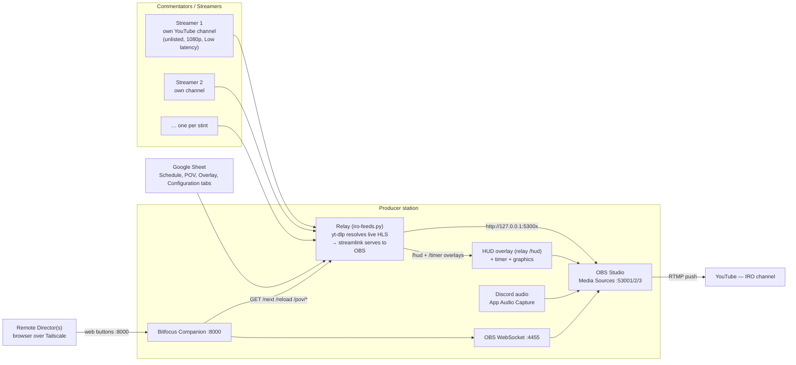
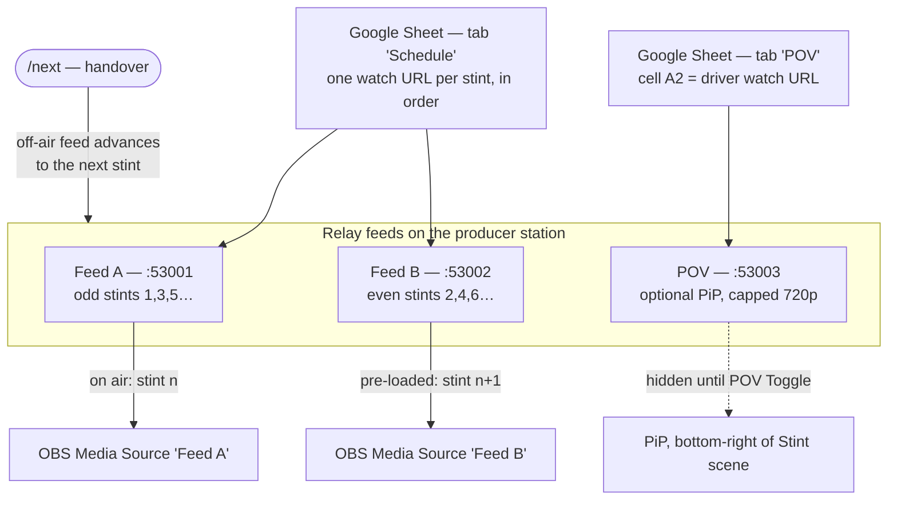
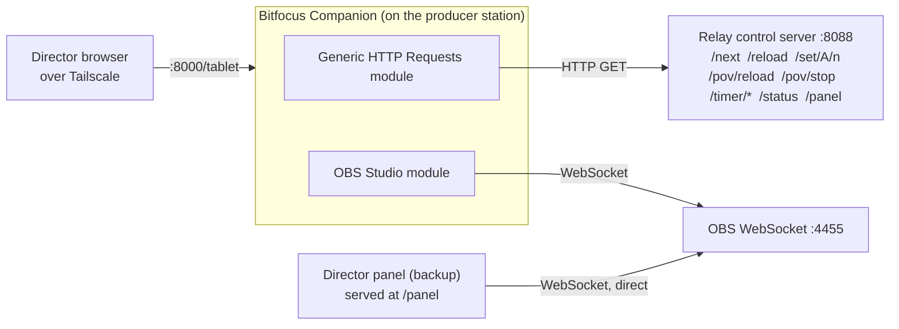
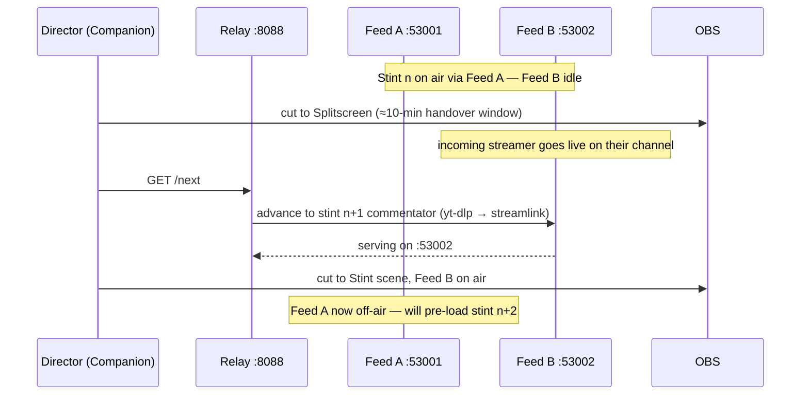

# Architecture

> Technical reference. Just running a show? See [Run an event](Run-an-event).

How the broadcast station fits together, in four views: the **system topology**, the
**relay ping-pong**, the **control flow**, and a **stint handover** over time.

## Core idea

**Source switching keeps full buffering.** Each commentator stream is pulled by the
producer station and served on a *fixed local port*. OBS points at those fixed ports
and never changes URL. The director only switches **scenes/sources** — no URLs are
ever typed, no processes restarted. This gives Streamlink's ring buffer **and** OBS's
own network buffer **and** full remote switching at once.

**Quality: 1080p target, never below 720p.** Streamers ingest at 1080p so YouTube
generates both a 1080p and a 720p rendition; the pull side prefers
`1080p60,1080p,720p60,720p` and will not drop below 720p.

---

## 1. System topology

Streamers push to their own YouTube channels; the producer station pulls them in, composes
the show with overlays and Discord audio, and pushes one broadcast to the IRO channel.
Remote directors drive it from a browser over Tailscale.

The producer's only live job: **start and stop** the IRO broadcast. Everything else is
the director's, done remotely.

---

## 2. Relay ping-pong (the endurance flow)

Two fixed feeds "walk" along a **stint schedule**. Feed A serves the odd stints
(1, 3, 5…), Feed B the even ones (2, 4, 6…) (when starting from stint 1; a
`--stint N` takeover starts the same ping-pong at stint N on Feed A). At each handover the **off-air** feed
advances to the next commentator's stream, so the on-air OBS media source never changes
URL. A third **POV** feed is an optional driver picture-in-picture.

A running feed is **never** torn off mid-stint. Sheet edits apply on the next `/next`
(handover) or `/reload`. See [Relay Mode](Relay-Mode) for the operating procedure.

### The HUD overlay

The lower-third HUD is **one** relay-served page, not a pile of OBS browser sources.
The relay reads the **Overlay** tab (live values: streamer, session, round, top-3
teams, race control) and the **Configuration** tab (team → manufacturer via a
`Brand Name` column) as gviz CSV, and serves:

- `GET /hud` — a single transparent overlay page (one OBS Browser Source at
  `http://127.0.0.1:8088/hud`),
- `GET /hud/data` — the live values as JSON (the page polls it every ~2.5 s, so sheet
  edits appear with no manual reload),
- `GET /hud/assets/{flags,brands}/<key>` — bundled flag/brand logos, resolved from text.

The race timer is also relay-served (`/timer`, fixed loopback URL); state: Sheet
tab `Timer` + `runtime/timer.json`, Director-controlled via `/timer/*` endpoints.

---

## 3. Control flow

The director never touches the producer machine directly. Companion talks to OBS over
its WebSocket and to the relay over plain HTTP GETs. The **director panel** is a backup
that talks to OBS directly (and is therefore less convenient — it needs the OBS
password).

The relay control server is **unauthenticated** and bound to `127.0.0.1` by default.
For remote directors, prefer binding it to the producer's **Tailscale IP** rather than
`0.0.0.0` — `/status` reveals stream URLs.

---

## 4. Stint handover (over time)

What happens at a driver/lobby change, roughly every two hours. The incoming streamer
goes live; the director cuts to splitscreen for the handover window, presses `/next`,
then cuts to the new feed. Nothing is typed.

---

## Ports at a glance

| Port | Service |
|------|---------|
| `53001` | Relay Feed A (odd stints) |
| `53002` | Relay Feed B (even stints) |
| `53003` | Relay POV feed (PiP) |
| `8088`  | Relay control server (HTTP GET endpoints, `/panel`) |
| `4455`  | OBS WebSocket server |
| `8000`  | Companion admin + web buttons (`/tablet`) |

See [Set up the broadcast PC](Set-up-the-broadcast-PC) to put all of this on a machine.
