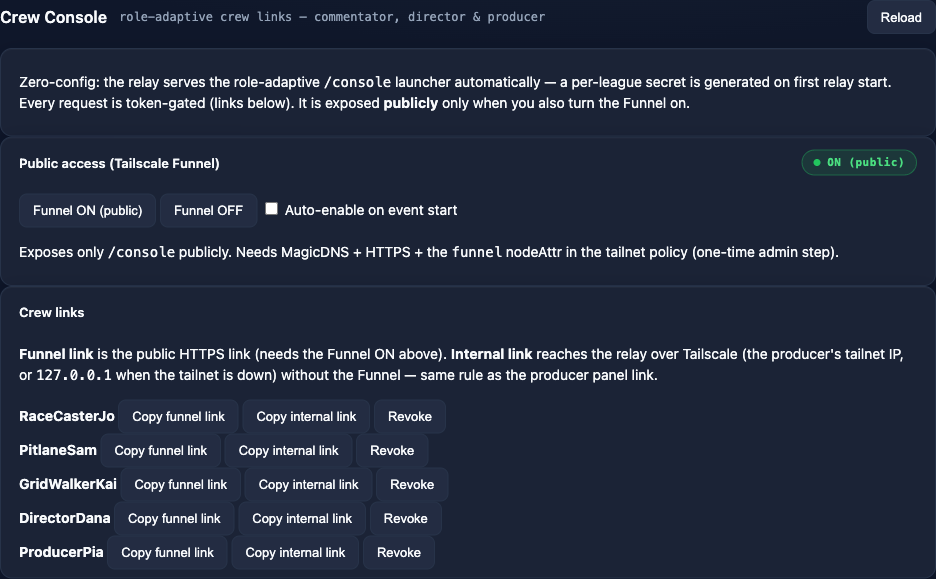

# Commentator Cockpit

A **talent-facing** page served by the relay — the counterpart to the Director
Panel, but for the **commentators**. Each commentator opens one personal link and
gets a self-contained cockpit:

- **Live program monitor** — the actual broadcast output (low-bandwidth JPEG stills).
- **Tally** — a large **YOU ARE ON AIR** indicator plus an **UP NEXT · stint N · in
  X handovers** cue (and, while on air, their next own stint).
- **Crew chat** — the same chat as the Director Panel, attributed to the commentator.
- **Race timer** — the live remaining-time clock.



It is served under its own `/cockpit/*` path namespace and can be reached two ways:

- **Tailnet** — `http://<producer-tailscale-ip>:8088/cockpit?t=<token>` for crew who
  are already on the tailnet (e.g. a phone with the Tailscale app).
- **Public, via Tailscale Funnel** — `https://<your-magicdns-host>/cockpit?t=<token>`
  for commentators **without** a Tailscale account (free-tier friendly). Funnel maps
  **only** the `/cockpit` path; the rest of the relay (`/panel`, `/status`, feeds)
  stays tailnet/loopback-only.

## Authentication

Every `/cockpit` request authenticates server-side (Funnel passes no Tailscale
identity). Each commentator gets a **signed per-person token**
`<streamer_key>.<version>.<sig>`, derived from a **per-league secret**
`COCKPIT_SECRET` (in `profiles/<league>/profile.env`, auto-generated on enable, and
carried by `racecast profile export`/import). The token rides in the link once, then
moves into an `HttpOnly` cookie. Revoking one person bumps their version — see below.

## Enable it (per machine + per league)

```bash
racecast cockpit enable      # generate the league COCKPIT_SECRET + flip the machine switch
racecast relay restart       # the relay decides /cockpit at launch
racecast cockpit links       # print every commentator's tailnet + funnel link
```

`enable` does two things: writes `COCKPIT_SECRET` into the active profile's
`profile.env` (if absent) and sets the machine-local `RACECAST_COCKPIT_ENABLED=true`
in `.env`. Both must be present or `/cockpit/*` returns 404 (like chat/timer when
off). The link roster is the distinct streamer names in the active schedule.

`racecast cockpit links --post` also drops the links into the crew chat.

## Public access via Tailscale Funnel — one-time setup

Funnel is available on **all Tailscale plans incl. the free tier**, but it needs a
**one-time tailnet-admin** setup before `racecast cockpit funnel on` will work. These
are **control-plane** settings — they live in the Tailscale admin console, **not** on
this machine, so they cannot be scripted from the node.

At <https://login.tailscale.com/admin>:

1. **DNS** → enable **MagicDNS** and **HTTPS Certificates**.
2. **Access Controls** (the policy file) → grant this node the **`funnel`** nodeAttr:

   ```json
   "nodeAttrs": [
     { "target": ["autogroup:member"], "attr": ["funnel"] }
   ]
   ```

   Scope `target` as tightly as you like (a specific tag or device instead of
   `autogroup:member`).

### Automate the tailnet setup — `racecast cockpit setup-funnel`

Steps 1–2 can be done from the producer machine instead of clicking through the admin
console, using a **Tailscale API access token** (or an OAuth client).

#### Get the API credential (the "admin token")

You need to be a tailnet **Owner / Admin / Network-admin**. Both options live on the
Admin console **Settings → Keys** page.

**Easiest — an API access token:**

1. Open **<https://login.tailscale.com/admin/settings/keys>** (Admin console →
   **Settings → Keys**).
2. Under **API access tokens**, click **Generate access token…**, add a description
   (e.g. `racecast funnel setup`), and generate. It shows a `tskey-api-…` value
   **once** — copy it.
3. Put it in your machine `.env` (next to the binary / repo root — gitignored):
   ```
   RACECAST_TS_API_KEY=tskey-api-...
   ```

`setup-funnel` is a **one-off**: MagicDNS and the `funnel` nodeAttr stay in the policy
afterwards, so you only need the token for that single run. **Generate it, run
setup-funnel, then revoke it and clear the `.env` line** — don't keep it around. The
token's ≤90-day expiry is therefore a non-issue (you're not renewing anything). It
has full account access while it exists, so treat it like a password.

**Alternative — a scopable OAuth client** (least-privilege, doesn't expire): further
down the same **Keys** page, under **OAuth clients**, generate one with **Write**
access to **DNS** and the **Policy file (ACL)** only, then set instead:
```
RACECAST_TS_OAUTH_CLIENT_ID=<id>
RACECAST_TS_OAUTH_CLIENT_SECRET=tskey-client-...
```

> Either credential can rewrite your tailnet policy — treat it like a password, keep
> it only in `.env` (never committed), and it is only needed while running
> `setup-funnel`, never during a broadcast.

#### Run it

```bash
racecast cockpit setup-funnel            # dry-run: shows what it would change
racecast cockpit setup-funnel --apply    # enable MagicDNS + add the funnel nodeAttr
```

`--apply` enables MagicDNS (a safe single preference) and appends the `funnel`
nodeAttr to the policy. Because the API returns the policy as plain JSON, the write
**reformats your ACL and drops HuJSON comments** — so it **backs up the current
policy** to `runtime/ts-acl-backup-<ts>.json` first and uses an `If-Match` ETag to
avoid clobbering a concurrent edit. **HTTPS Certificates** has no API; enable it once
on the DNS page (the command reminds you). The OAuth secret can rewrite the tailnet
policy — keep it in `.env` (gitignored), never commit it. Scope `--target` to a tag
instead of the default `autogroup:member` if you want a tighter grant.

Then, on the producer machine:

```bash
racecast cockpit funnel on    # publish ONLY /cockpit on https://<magicdns-host>
racecast cockpit funnel off   # tear it down
```

`racecast cockpit funnel on` **pre-checks** the `funnel` nodeAttr and fails fast with
these exact steps if it is missing (rather than hanging on Tailscale's interactive
enable prompt). Pass `--force` to skip the pre-check.

> **Security boundary:** Funnel forwards only the `/cockpit` path. Confirm from
> outside the tailnet that `https://<magicdns-host>/status` and `/panel` are **not**
> reachable — only `/cockpit` should be.

The Funnel host is the **active producer's** MagicDNS name. On a producer handover
it changes, so re-run `racecast cockpit links` on the new machine and re-share.

## Revoking / rotating a link

```bash
racecast cockpit token revoke "<streamer name>"   # bump that person's version
racecast cockpit links                            # re-issue their (now-newer) link
```

The old link's version is now stale and is rejected immediately (the relay reads the
revocation file per request — no restart, no secret rotation, nobody else affected).
Revocations are stored in `runtime/<league>/cockpit-versions.json`.

## Producer handover

The league secret travels with the profile, so producer B regenerates
byte-identical default links. `racecast event takeover` also pulls A's
`cockpit-versions.json` over the tailnet (authenticated with the shared secret) so
any revocations A made are honored on B. Because the Funnel host changes, re-publish
the links after takeover.

## Control Center

The **Cockpit** view in the [Control Center](Control-Center) mirrors all of this:
enable toggle, Funnel on/off, the per-commentator link list with copy + revoke.

## Not included (v1)

Commentator self-service stream-link submission, audio talkback/IFB, WebRTC/SRT/RTMP
guest ingest, and recording are deliberately out of scope.
