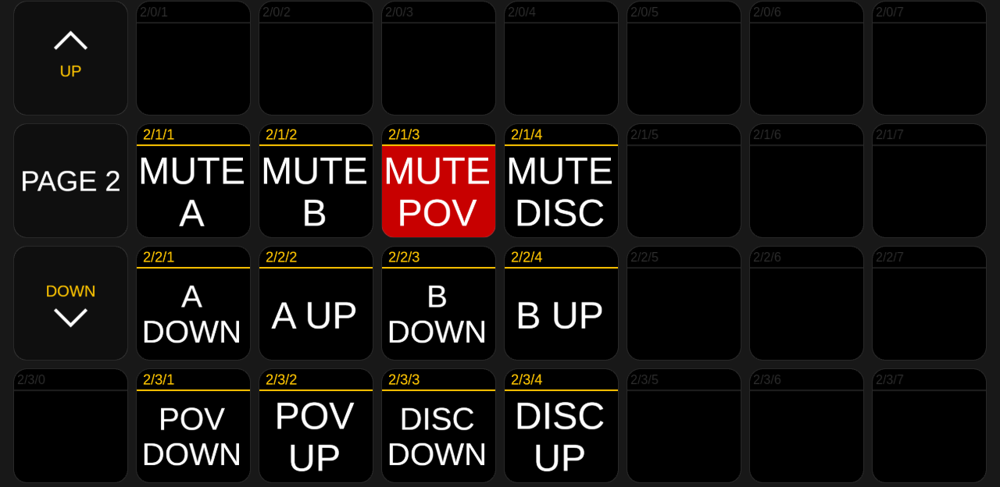

# Companion

Bitfocus Companion is the director's button board: a grid of buttons served as a web
page that directors open in a browser. It is the **primary** control surface and is
strictly more capable than the [backup director panel](Director). Install it first per
[Installation](Installation).

## Import the button board

1. Start Companion → launcher → **GUI Interface = All Interfaces (0.0.0.0)** (important
   for Tailscale), admin port `8000` → **Launch GUI**.
2. In the admin: **Import/Export → Import** → `companion/iro-buttons.companionconfig`.
   This is a **full config** → confirm **"Replace current configuration"**.

> ⚠️ This **replaces the entire Companion configuration** on this station. Fine for a
> fresh/dedicated producer station; **back up first** if this Companion holds other
> content.

## Connect to OBS

The **OBS connection** (`127.0.0.1:4455`) comes with the config — **but without the
password** (removed for security). → **Connections** → open the OBS entry → **enter your
OBS WebSocket password** (the one you set in [Installation](Installation)) → the
connection turns green.

## The buttons (two pages)

**Page 1 — show control**

| Row | Buttons |
|-----|---------|
| 0 — combos | `SPLIT`, `STINT A`, `STINT B`, `INTERVIEW`, `STANDBY` (one-press scene+source presets) |
| 1 — scenes + relay | `Stint Scene`, `Split Scene`, `Interview Scene`, `Standby Scene`, `Feeds Reload` (→ `/reload`), `Feeds Next` (→ `/next`, the handover), `Feeds Status` (→ `/status`) |
| 2 — feeds &amp; POV | `Feed A Toggle`, `Feed B Toggle`, `POV Toggle`, `Split Left`, `Split Right`, `POV Reload`, `POV Stop` |
| 3 — graphics | `Standings`, `Schedule`, `Race Results`, `Quali Results`, `HUD Stint Toggle`, `HUD Split Toggle` |

**Page 2 — audio**

| Row | Buttons |
|-----|---------|
| 1 — mute | `MUTE A`, `MUTE B`, `MUTE POV`, `MUTE DISC` |
| 2 — volume A/B | `A DOWN`/`A UP`, `B DOWN`/`B UP` |
| 3 — volume POV/Discord | `POV DOWN`/`POV UP`, `DISC DOWN`/`DISC UP` |

> The left column on each page (`UP` / `DOWN`) flips between **Page 1** (show control)
> and **Page 2** (audio).

The relay buttons (`Feeds Next`, `Feeds Reload`, `Feeds Status`, `POV Reload`,
`POV Stop`) use the **Generic HTTP Requests** connection — see
[Relay Mode §4](Relay-Mode#4-control-it-companion--relay). Everything else uses the OBS
connection.

## Test

Open `http://localhost:8000/tablet`, press a button → OBS reacts. For remote directors,
see [Director (Remote)](Director).

## State feedback (optional)

A button can light up when its scene/source is live: in the button editor → **Add
feedback** → **Source Visible** / **Scene Active** → pick a highlight color. Now the
director always sees what's on air. A button can also hold **multiple stacked actions** —
e.g. one "Go to Interview" that switches scene *and* shows the lower-third *and* unmutes
Discord (this is how the row-0 combos work).
