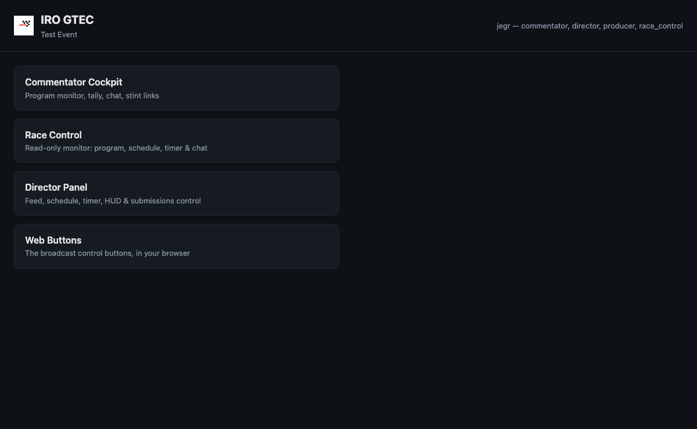
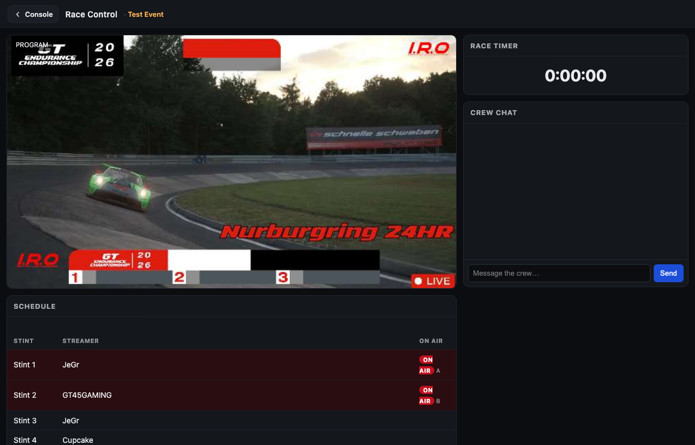

# The Console launcher

`/console` is the **single personal link** every crew member opens. Instead of
separate URLs for each surface, one link adapts to the signed-in person's role and
shows only the cards they are allowed to use — nothing more.

## How it works

`racecast links` generates one signed `/console` link per person (union of the Crew tab
and the live schedule). The producer shares each link with the relevant person. Opening it
in any browser authenticates the person and renders their personalised landing page.

The same link works **over the tailnet** (e.g. a phone with the Tailscale app) **or over
the public Funnel** (`racecast funnel on` — no Tailscale account needed on the crew
member's side). See [Remote access & the Funnel boundary](Remote-access) for the full
security model.

## The cards

| Card | Path | Who sees it |
|---|---|---|
| **Commentator Cockpit** | `/console/cockpit` | any authenticated person |
| **Race Control** | `/console/race-control` | crew flagged **Race Control** |
| **Director Panel** | `/console/panel` | directors |
| **Web Buttons** | `/console/buttons` | directors (requires Companion ≥ v4.1.0) |

Each card leads to the same page as its tailnet equivalent — `/cockpit`, `/panel`, and
the Companion Web Buttons board at `:8000/tablet` respectively — but reached through
the role-gated `/console` mirror, with API calls transparently routed to the correct
endpoints.

### Race Control (read-only monitoring desk)

**Race Control** is a *read-only* surface for a monitoring desk: a live **program
preview**, the **streamer / stint schedule**, the **race timer**, and **crew chat**
(posted under the desk operator's own name). It triggers **no broadcast actions** — the
**director keeps full control of the Panel**. Flag a person for it with the **Race
Control** column on the Sheet's Crew tab (or the Control Center crew editor); the role
string is `race_control`. The schedule it shows is **redacted** — stream URLs never leave
the tailnet, the same boundary as the producer-takeover status — so the desk is safe over
the public Funnel.

> **Naming note:** the role shares its label with the director-only HUD **Race Control**
> banner (the Setup-tab `Race Control` field shown on the lower third). They are
> unrelated: the role is `race_control` (Crew tab), the banner is `racecontrol` (Setup
> tab). This role never writes to that banner.

All three cards open **in the same tab**. Every destination carries a **`← Console`**
back link in its header that returns to this launcher, so there is clean
forward-and-back navigation without relying on the browser history. The Web Buttons card
opens a thin `/console/buttons` wrapper that embeds the Companion board in an iframe and
hosts that back link (Companion's own page can't carry it); the buttons themselves are
unchanged. The back link is shown only under the `/console` mount — at the tailnet
`/cockpit` and `/panel` URLs there is no launcher to return to, so it stays hidden.

A person can hold multiple roles (e.g. a commentator who is also a director); all
their cards appear on one landing page. Roles are resolved live from the Crew tab and
the active schedule on every request, so a role change takes effect immediately without
re-issuing the link.

## Further reading

- [League-Owner Setup](League-Owner-Setup) — how to configure Discord OAuth, register
  redirect URIs, and maintain the Crew tab so crew members can log in with Discord.
- [Remote access & the Funnel boundary](Remote-access) — security model, the Funnel
  mount, and how roles are authorised.
- [Commentator Cockpit](Commentator-Cockpit) — the talent-facing cockpit in detail.
- [Director guide](Director) — the full Director Panel reference.
- [Companion (button config)](Companion) — the Web Buttons board and how to configure
  Companion buttons.

---

> This page is generated from `src/docs/wiki/` in the
> [main repository](https://github.com/jegr78/gt-endurance-racing-broadcast) — don't edit it
> here by hand. See [Build & maintenance](Build-and-maintenance).
