# The Control Center

The **Control Center** is a local web app that runs the whole producer station —
first-time setup, event-day bring-up, service control, logs — from your browser,
no terminal needed. It is the recommended way to drive the station. Everything it
does is also available as a `racecast …` command (shown as a *CLI alternative*
throughout the operator guides), so the terminal stays a first-class option for
Linux, scripting, and remote sessions.

It is shipped in the same release archive as the CLI: alongside the `racecast` binary
you get **`racecast-ui`**, the Control Center launcher.

## Launch it

| Platform | How |
|---|---|
| **Windows** | Double-click **`racecast-ui.exe`**. |
| **macOS** | Double-click **`racecast-ui.app`**. |
| **Linux** | Run `./racecast-ui` (or `./racecast ui`) — most Linux desktops don't launch a plain binary on double-click. |

It opens your default browser at `http://127.0.0.1:8089/`. Keep `racecast-ui` in the
same folder as `racecast`, your `.env` and `profiles/` — the two binaries sit side by
side and share the `runtime/` folder next to them.

- **Already running?** Launching again just reopens the browser — there is only
  ever one Control Center per machine.
- **Closing the tab** leaves it running in the background. Use the **Quit**
  button (bottom-left) to stop the server. Stopping the Control Center does *not*
  stop the relay, Companion, or streams — those are independent and keep running.
- **Port busy?** Set `RACECAST_UI_PORT` in `.env` to a free port and relaunch.

> **CLI alternative:** `racecast ui` runs the same server in a terminal (add
> `--no-browser` to skip opening a tab). `racecast ui` and `racecast-ui` are interchangeable.

## Security — keep it local

The Control Center listens on `127.0.0.1` only (this machine). Its API is
unauthenticated and can start installs and stop services, so it is deliberately
**not** reachable from the LAN or the tailnet. Don't put it behind a proxy or
forward its port. (The director's panel and Companion tablet *are* reached over
Tailscale — those are separate, see [Director setup](Director-Setup).)

## A tour of the views

The left sidebar holds every view. The docked **Console** at the bottom streams
the live output of any action you run.

### Home

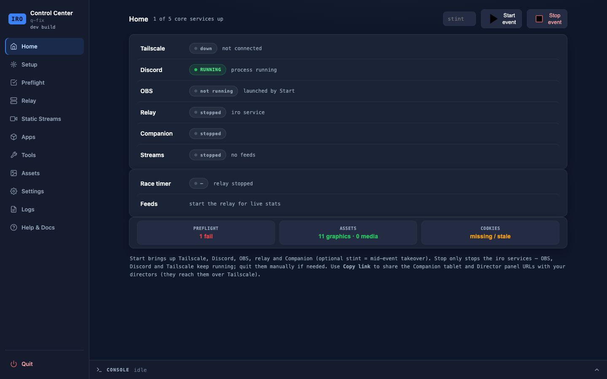

The dashboard. At a glance: how many core services are up, the state of Tailscale,
Discord, OBS, the relay, Companion and the static streams, the race-timer state,
and tiles for Preflight / Assets / Cookies readiness. **Start event** brings the
station up (optional stint number for a mid-event takeover); **Stop event** winds
the `racecast` services down. The sidebar also shows the **active league profile**
(click it to jump to the Profile view). From here you also open the Director panel
and copy the director/tablet links.

> **CLI alternative:** `racecast status`, `racecast event start [--stint N]`, `racecast event stop`.

### Setup

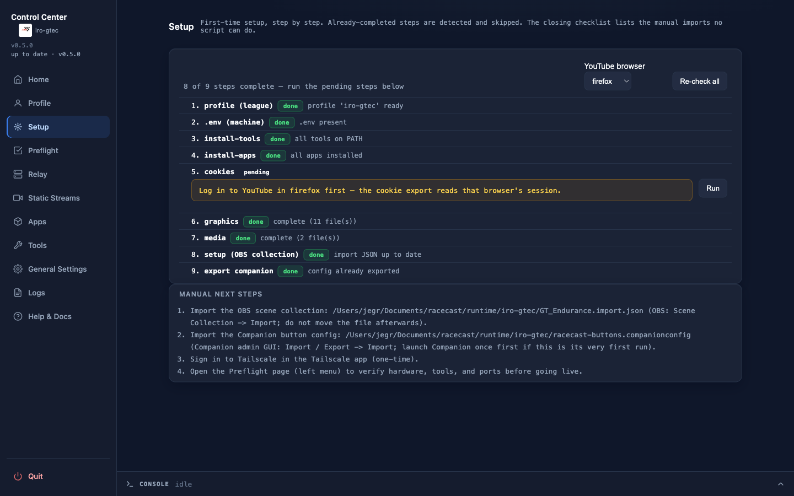

The first-time-setup **wizard**. It detects what is already done and marks each
step `done` or `pending`, with a running "*X of N complete*" summary. Run the
pending steps in order — creating/selecting a league profile, installs, YouTube
cookies, broadcast graphics, intro/outro media, the OBS scene collection, the
Companion config — each streams its
output in the Console. **Re-check all** re-reads the state (e.g. after you fill in
the active profile's `SHEET_ID`). The closing **Manual next steps** list covers the
imports no script can do (importing the OBS collection and Companion config, signing in
to Tailscale).

> **CLI alternative:** `racecast init` runs the same steps in the terminal.

### Preflight

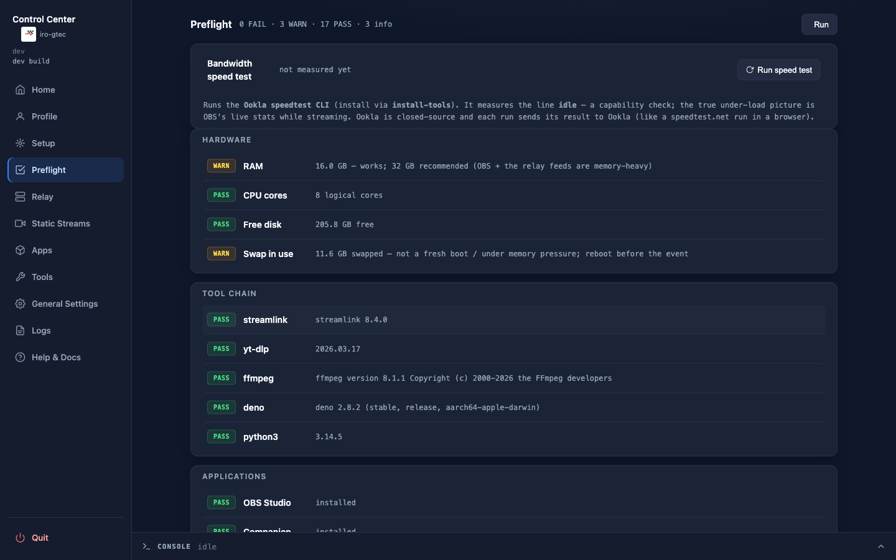

A read-only hardware and tooling check: RAM, CPU, disk, swap; the four command-
line tools (`yt-dlp`, `streamlink`, `ffmpeg`, `deno`) with versions; and the four
apps (OBS, Companion, Tailscale, Discord). Each line is `PASS` / `WARN` / `INFO` /
`FAIL`. **Run** re-checks.

> **CLI alternative:** `racecast preflight`.

### Apps & Tools

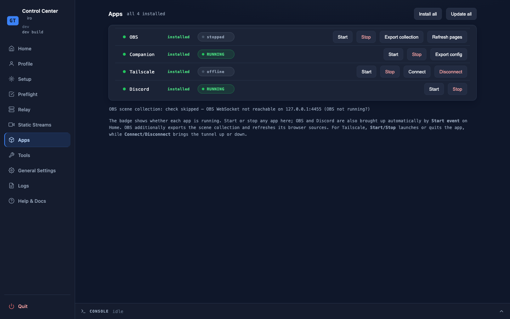

**Apps** installs, launches, quits and shows the status of OBS, Companion,
Tailscale and Discord. **Tools** does the same for the command-line tools
(`yt-dlp`, `streamlink`, `ffmpeg`, `deno`), with **Install all** / **Update all**.

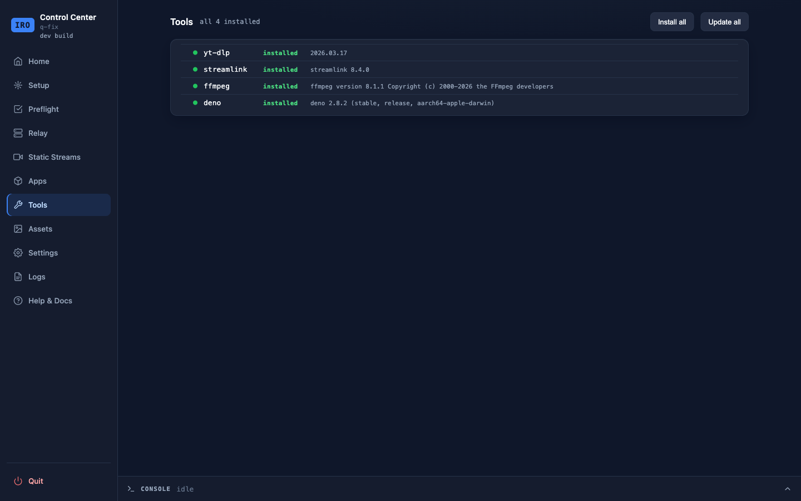

> **CLI alternative:** `racecast install-apps`, `racecast install-tools` (add `--update` to
> upgrade), `racecast app launch|quit obs|discord|tailscale`.

### Relay & Static Streams

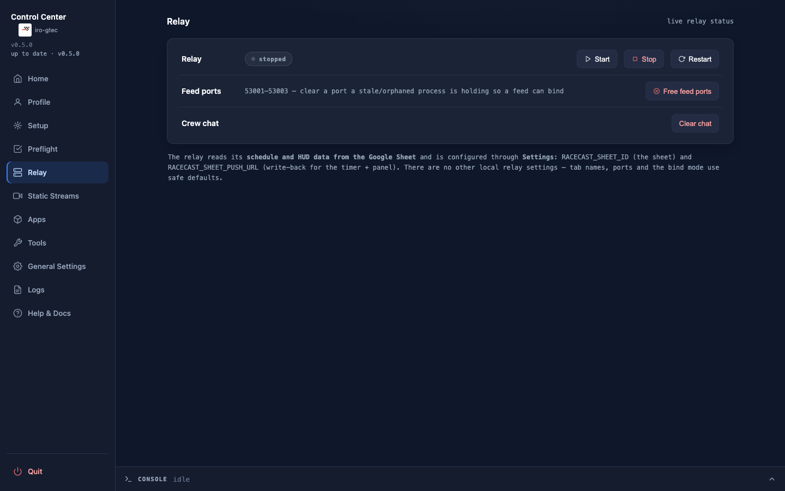

**Relay** starts / stops / restarts the commentator-feed relay (the normal mode)
and shows its live status. It reads its schedule and HUD data from the **active
profile's** Google Sheet, and applies that profile's overlay CSS; there are no local
relay knobs — ports and bind mode use safe defaults.

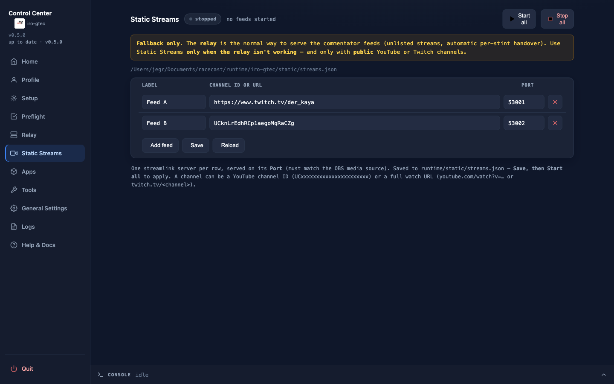

**Static Streams** is the **fallback** for plain public channels when the relay
mode can't be used. Edit the channel/port list here and start/stop the set.

> **CLI alternative:** `racecast relay start|stop|restart|status|logs`,
> `racecast streams start|stop`.

### Profile

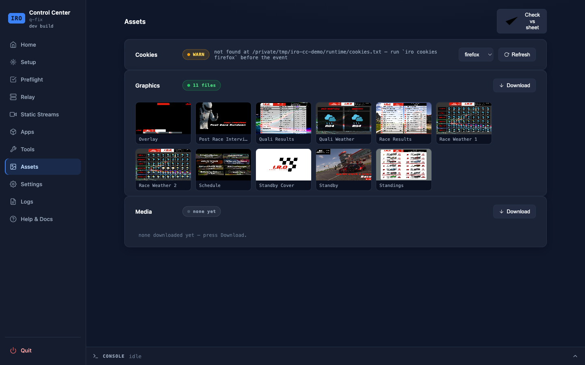

Everything that belongs to a **league**, gathered in one view (the model behind it is in
[League profiles](Profiles)):

- **Active profile** — a switcher to change the active league (every other view then
  acts on it), and a **New profile** dialog that copies an existing profile (e.g.
  `example`) into a new one.
- **`profile.env` editor** — the active league's config (Sheet ID, push URL,
  intro/outro, logo, and the OBS scene-collection name `OBS_COLLECTION`). Secret values
  are **masked** — click the eye to reveal one. Changes apply the next time you (re)start
  the relay.
- **Overlay CSS** — per-profile CSS for the relay-served **HUD** and **Timer** pages
  (`profiles/<active>/overlay/`; see [HUD overlays](HUD-Overlays)). **Save** writes the file;
  **Apply in OBS** reloads the browser sources (same as `obs refresh`). The first override on
  a profile that had no `overlay/` yet needs one `racecast relay restart` to activate; later
  edits apply live.
- **Assets** — the active profile's broadcast graphics and intro/outro media. Thumbnails
  show which graphics are present; **Download** fetches them from the Sheet's Assets tab;
  **Check vs sheet** compares what's on disk against what the Sheet lists.

> **CLI alternative:** `racecast profile list|show|use|new`, `racecast graphics`,
> `racecast media`. Edit `profiles/<name>/profile.env` and
> `profiles/<name>/overlay/{hud,timer}.css` in any text editor.

### General Settings

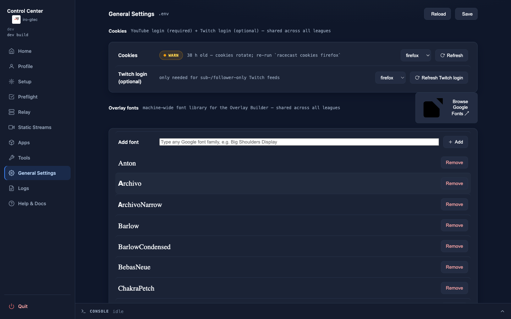

Machine-wide (not league) configuration:

- A safe editor for the local `.env` (this machine only — OBS-WebSocket password,
  Control Center port, the Windows Companion path). Secret values are **masked** — click
  the eye to reveal one. Comments in the file are preserved. Changes apply the next time
  you (re)start the affected service.
- **YouTube cookies** — freshness status, re-exported with **Refresh** (pick the browser).

> **CLI alternative:** edit `.env` in any text editor; `racecast cookies <browser>`.

### Logs

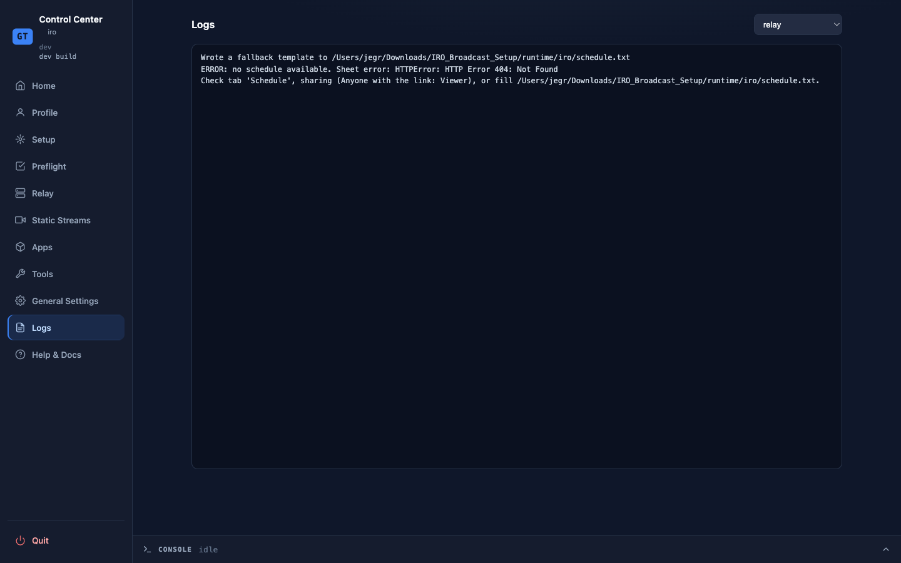

Live tail of the relay, Companion and static-stream logs — pick a source from the
dropdown. The example above shows the relay reporting it couldn't reach its Google
Sheet (a misconfigured-sheet state).

> **CLI alternative:** `racecast relay logs -f` (and `companion` / `streams`).

### Help & Docs

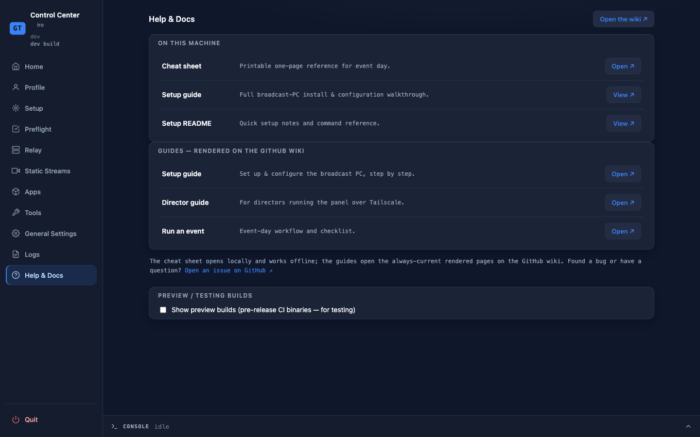

The bundled cheat sheet and setup guides (rendered offline, on this machine) plus
links to the always-current pages on this wiki.

## Where to go next

- **Setting up a machine?** → [Set up the broadcast PC](Set-up-the-broadcast-PC)
- **Running a show today?** → [Run an event](Run-an-event)
- **The remote director?** → [Director setup](Director-Setup), then the
  [Director guide](Director)

---

> This page is generated from `src/docs/wiki/` in the
> [main repository](https://github.com/jegr78/gt-endurance-racing-broadcast) — don't edit it
> here by hand. See [Build & maintenance](Build-and-maintenance).
