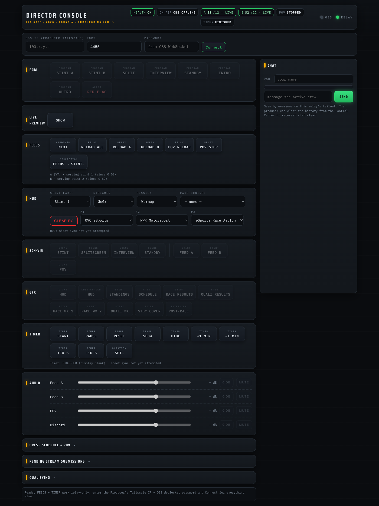

# Director guide

You direct the show **from a browser** — no OBS, no software on your machine.
You never touch the producer's PC. Several directors can take turns, and the
producer can also direct locally.

First time? [Director setup](Director-Setup) gets your device connected in
about 5 minutes. From there you have two ways to drive the show:

## Panel or Companion buttons?

Both control the same broadcast. The **director panel** is the primary surface —
one page with every control, plus the Schedule/POV/chat editors, live status and
health warnings; the **Companion buttons** are a hardware-style alternative (the
same layout a Stream Deck uses) for those who prefer large physical buttons. The
practical differences:

| | Director panel (`…:8088/panel`) | Companion buttons (`…:8000/tablet`) |
|---|---|---|
| What it is | one page with everything — program switches, feeds, HUD, graphics, timer, audio — plus live status and health warnings | the big-button board (same layout as a Stream Deck) |
| Needs | the **OBS WebSocket password** from the producer for scene/audio control: enter the producer's IP, port `4455` and the password once at the top of the panel — the browser remembers them. **FEEDS, TIMER, HUD and URLs work without it** | nothing — the OBS connection lives on the producer's machine |
| Strengths | one-tab overview; shows problems early (banners, feed health) | muscle memory; very large touch targets |

## The director panel

Open `http://<producer-tailscale-ip>:8088/panel`. The page is organized as
horizontal busses; the Stream Deck pages and the panel share one muscle
memory:

| Bus | What's on it |
|---|---|
| **PGM** | one-press program looks — `STINT A/B`, `SPLIT`, `INTERVIEW`, `STANDBY`, `INTRO`, `OUTRO`, `RED FLAG` (same behavior as the Companion combos below) |
| **FEEDS** | `NEXT` (the handover), per-feed reloads, POV reload/stop, `FEEDS → STINT…` |
| **HUD** | the Stint label, Streamer, Session and Race Control dropdowns — they update the HUD live and write back to the Setup tab |
| **SCN·VIS** | raw scene switches and feed visibility toggles |
| **GFX** | graphics toggles (HUD, standings, schedule, results, weather, covers) |
| **TIMER** | the race timer ([Race Timer](Race-Timer)) |
| **AUDIO** | per-source dB sliders, 0 dB reset and mutes |
| **URLs** | collapsible editor for the schedule and POV URLs |

**FEEDS, TIMER, HUD and URLs work relay-only** — no OBS connection needed
(HUD and URLs additionally need the sheet-write webhook, see
[Sheet-Webhook](Sheet-Webhook); without it they are display-only). Everything
else needs the OBS WebSocket connection from the panel header (see the table
above).

### Status strip and feed health

The strip at the top shows what is on air, the race timer, and one pill per
feed with its stint and state: `A S3 · LIVE` (green — serving), `B S4 · CONN`
(amber — still connecting), `IDLE`, or `STOPPED`. The FEEDS bus adds a health
line per feed, e.g. `A · serving stint 3 (since 1:32:08)`. When a feed has
been connecting for more than ~30 seconds the line turns amber and warns
`stream may not be live yet` — usually the streamer simply hasn't started;
the exact error from the producer's machine is appended when there is one.
The POV feed joins the line while it is connecting or serving.

### Event title

The header subtitle shows the **event title** — a free-text label for this
round, e.g. `GTEC - 2026 - Round 4 - Nürburgring 24h`. It is the same title
shown in the [Commentator Cockpit](Commentator-Cockpit) and on every Discord
message, so the whole crew sees one consistent name. Click the **✎** next to it
to edit it live (Enter saves, Esc cancels); the change applies immediately and
is remembered across a relay restart. The producer can also preset it with
`racecast event start --title "…"` or the league's `EVENT_TITLE` default. It is
**producer-side runtime state** — it is never written to the Google Sheet (see
[Sheet-Webhook](Sheet-Webhook)). Leave it blank and the header keeps its static
text.

### Warning banners

Ongoing problems show as banners directly under the header — they appear
while the condition holds and disappear on their own when it is resolved:

| Banner | Meaning | Who acts |
|---|---|---|
| **RELAY UNREACHABLE** (red) | the panel cannot reach the producer's relay — buttons in FEEDS/TIMER will not work | tell the producer (`racecast status` on their side names the problem) |
| **SHEET SYNC FAILED** (red) | a write to the shared sheet did not go through | tell the producer; re-try the change once the banner clears |
| **TIMER SHEET SYNC FAILED** (red) | the race timer's state is not reaching the sheet — a producer handover would not pick up the correct remaining time | tell the producer; details in [Race Timer](Race-Timer) |
| **COOKIES N H OLD** (amber) | the producer's YouTube cookies are stale — the **next handover may fail** | tell the producer: `racecast cookies firefox` on the producer machine |

One-off action failures (a button press that didn't take) show as short
toasts in the top-right corner and are also logged in the log box at the
bottom.

### Guarded buttons

- `RELOAD A` / `RELOAD B` / `RELOAD ALL` ask for confirmation — a reload
  tears the feed's pull and means a brief interruption if that feed is on
  air.
- `NEXT` locks for 3 seconds after a press, so a double-tap cannot advance
  two stints.

> **Two things are called "stint".** `FEEDS → STINT…` (FEEDS bus) re-targets
> the actual feeds to a stint number — it interrupts running pulls and is for
> corrections/takeovers. **STINT LABEL** (HUD bus) only changes the text
> viewers see on the overlay — harmless. Advancing to the next commentator
> stream is `NEXT`.

## Director panel — HUD row

The **HUD bus** has four dropdowns: **Stint label**, **Streamer**,
**Session**, and **Race Control** (plus a **CLEAR RC** button). The options
come from the Configuration tab of the sheet — any new streamers or messages
added there are picked up automatically without changing the panel.

Each change takes effect on the HUD immediately and is written to the sheet's
Setup tab in the background. An amber outline on the dropdown means the write
is pending; the HUD status line shows the sync state. The panel is the primary
way to set these fields; editing the Setup-tab dropdowns in the sheet directly
is an equivalent fallback when you don't have the panel open.

The panel HUD row needs the sheet-write webhook (the profile's `SHEET_PUSH_URL`);
without it the panel dropdowns are read-only. (The sheet's own dropdowns work
either way — they never need the webhook.) See [Sheet-Webhook](Sheet-Webhook).

## Director panel — URLs section

Below the main rows the panel has a collapsible **URLs** section. It shows the
Schedule tab entries (one per stint: **Streamer** + **Stint** label dropdowns +
stream URL; rows currently assigned to a live feed are marked A or B) and the
POV URL field. The Streamer and Stint dropdowns draw from the **same**
Configuration vocabulary as the HUD row dropdowns, so a row's values can never
drift out of vocab.

Saving a change writes it to the sheet — **no feed reconnects
automatically**. A new stream URL takes effect at the next **RELOAD A/B** /
**NEXT** for that feed (POV: **POV RELOAD**). Editing the Schedule tab in the
sheet directly has the same effect and is the fallback when you don't have the
panel open.

**Handover auto-fills the HUD.** When a stint goes on air via **NEXT** (or a
**FEEDS → STINT** takeover), the relay sets the HUD's **Streamer** and **Stint
label** from that Schedule row automatically — no manual HUD-row change per
stint. The HUD-row dropdowns remain available as a live correction; the next
handover re-asserts the schedule's values. A row whose Streamer/Stint is blank
or not in the Configuration vocab simply leaves the HUD field unchanged.

Each row also has a **CLEAR** button: it empties the row's Streamer + Stint +
URL in the sheet (after a confirmation). The row itself stays and can be
refilled later — rows are never deleted, because removing a row would shift the
stint numbering of everything after it.

The URLs section also needs the profile's `SHEET_PUSH_URL` — without it the fields are
read-only.

## Director panel — Qualifying

Qualifying usually runs on its own day and is a **single stream**. The panel has
a separate collapsible **Qualifying** section, kept apart from the race Schedule:

- **QUALIFYING MODE / RACE MODE** buttons switch the relay's *active schedule*.
  In qualifying mode the relay serves the **Qualifying** sheet tab on **Feed A**
  (Feed B idles — there is only one stream), so OBS needs no scene change. The
  switch re-points the feeds (it interrupts a running pull, so it is a
  between-session action, like the FEEDS → STINT takeover) and, on switch, the
  HUD's Streamer + Stint label follow the qualifying row — same mechanism as a
  race handover.
- A single editor row (**Streamer** + **Stint** dropdowns from the Configuration
  vocab + stream **URL**) writes the **Qualifying** tab. CLEAR empties the row.

The relay can also be brought up directly in qualifying mode with
`racecast event start --qualifying` (or `racecast relay start --qualifying`).
The Qualifying section needs the profile's `SHEET_PUSH_URL` for editing; serving
and mode-switching work read-only. If the sheet has no **Qualifying** tab the
section reports it and the controls are disabled. See
[Sheet-Webhook](Sheet-Webhook) for the one-time Apps Script redeploy that enables
qualifying write-back.

## Crew chat

The panel has a collapsible **Crew chat** section — a quick text channel for
everyone connected to the relay over the tailnet (directors, the producer, anyone
on the tailnet whose browser has the panel open). It is separate from Discord and
needs no setup beyond being on the tailnet.

**To use it:** type your name once into the Name field (the browser remembers it),
write a message, and press Enter or **Send**. Messages from all participants appear
in the chat box in order. A badge on the section header counts unread messages while
the section is collapsed — the count is keyed on the server timestamp, so it survives
a producer handover without re-firing.

Messages are visible to everyone whose browser can reach the relay. The relay holds
up to 200 messages in memory and persists them to `runtime/<profile>/chat.json` on
the producer's machine.

**Producer actions** (terminal or Control Center):
- `racecast chat clear` — wipe the history (also available as **Clear chat** in the
  Control Center). There is no HTTP endpoint that clears chat — this is a
  producer-only operation.
- `racecast chat export` — save the current history to `chat-export.json` (or `--out PATH`).
- `racecast chat pull <tailscale-ip>` — fetch another producer's relay history and
  adopt it locally, writing the file and signalling the relay to reload. This works
  at any time, including while the new producer's relay is already running. Use it at
  a producer handover to carry the conversation forward.
- `racecast chat import <file>` — load a previously exported JSON file into the relay.

## The Companion button board

The same show as big buttons: open
`http://<producer-tailscale-ip>:8000/tablet`. Two pages — **show control**
and **race timer & audio**. The left column on each page (`UP` / `DOWN`)
flips between them. Everything below is a single tap.

### Page 1 — show control

| Row | Buttons |
|-----|---------|
| **Combos** | `SPLIT`, `STINT A`, `STINT B`, `INTERVIEW`, `STANDBY`, `INTRO`, `OUTRO` — one press sets a whole look (the scene **and** the right feeds and audio). `SPLIT` also sets **Race Control → *Driver Swaps***; `STINT A` / `STINT B` **clear Race Control** on the way back — unconditionally, whatever it currently shows — as does the `Feeds Next` handover when it cuts the program back to **Stint**. `INTRO` / `OUTRO` cut to the looping intro/outro clip (with its own audio) and mute the live feeds; they light while on air. `RED FLAG` is a toggle: first press shows the Standby Cover in the Stint scene **and** sets Race Control to *Red Flag - Race Suspended*; second press hides the cover and clears Race Control. It lights red while the cover is up |
| **Scenes + relay** | `Stint Scene`, `Split Scene`, `Interview Scene`, `Standby Scene`, `Feeds Next` (the handover), `Feeds Reload`, `Feeds Status` |
| **Feeds & reloads** | `Feed A Toggle`, `Feed B Toggle`, `POV Toggle`, `Feed A Reload` (reconnect only Feed A → `/reload/A`), `Feed B Reload` (→ `/reload/B`), `POV Reload`, `POV Stop` |
| **Graphics & weather** | `Standings`, `Schedule`, `Race Results`, `Quali Results`, `Standby Toggle` (incident cover — see [The race](#through-the-broadcast-scene--hud-cues)), `Weather Race (1) Toggle`, `Weather Race (2) Toggle`, `Weather Quali Toggle` — the three weather buttons are full-screen Stint overlays, each an independent toggle like Standings/Results |

### Page 2 — race timer & audio

| Row | Buttons |
|-----|---------|
| **Race timer** | `TIMER START` (starts — or resumes a paused timer), `TIMER PAUSE` (freezes the remaining time on screen), `TIMER SHOW` / `TIMER HIDE` (overlay visibility), `TIMER +1 MIN` / `TIMER -1 MIN` (correction: shifts the running countdown, a paused remainder, or — before start — the race duration), `TIMER RESET` (back to the full duration). Stopwatch logic; details in [Race-Timer](Race-Timer) |
| **Mute** | `MUTE A`, `MUTE B`, `MUTE POV`, `MUTE DISC` |
| **Volume A / B** | `VOL A DOWN` / `VOL A UP` / `VOL A RESET`, `VOL B DOWN` / `VOL B UP` / `VOL B RESET` |
| **Volume POV / Discord** | `VOL POV DOWN` / `VOL POV UP` / `VOL POV RESET`, `VOL DISC DOWN` / `VOL DISC UP` / `VOL DISC RESET` |

> `VOL … UP` / `DOWN` nudge a source by ±3 dB (relative — they drift over a
> session); `VOL … RESET` snaps that source back to **0 dB** (its original
> level). Reset only touches the level, not the mute state — use the `MUTE …`
> buttons for that.

> Tip: for the everyday moves, use the **combo** buttons on page 1 (`STINT A`,
> `SPLIT`, `INTERVIEW`, …) — they set the scene and the audio in one tap.

How the board is imported and built: [Companion](Companion).

## Through the broadcast (scene + HUD cues)

The steps below name the Companion buttons; the panel has the same controls —
the combos sit on the **PGM** bus and **Feeds Next** is **NEXT** in the FEEDS
bus.

As director you drive two things: the **scenes** (Companion or panel) and
three **HUD fields** — **Stint**, **Session**, and **Race Control** — from the
panel's **HUD** bus (Companion carries the same dropdowns; editing the sheet's
Setup tab directly is the fallback). Each is a dropdown: pick the listed value,
or clear it to show nothing. The whole run, in order:

**At go-live (intro)**
- The producer starts streaming on **Standby**. Press **INTRO** to play the looping intro
  clip full-screen (with its own audio). Leave it running until the field is ready, then cut
  into the show (**STINT A** / **Splitscreen** for the formation lap). This is the **Intro
  video scene** — separate from the **Stint → Intro** HUD label below.

**Before the start**
- HUD: **Stint → Intro**, **Session → Warmup**.

**Formation lap** — the race always begins with a manual formation lap.
- HUD: **Race Control → Formation Lap**. Set it **after** the cut: the combos write
  Race Control too (**SPLIT** stamps *Driver Swaps*, **STINT A/B** and the **Feeds Next**
  handover clear it), so a combo or handover afterwards would wipe the *Formation Lap*
  message.
- As the formation lap starts: **Stint → Stint 1**, **Session → Race**.
- Just before the green flag: **clear Race Control**.

**The race**
- Keep the **Stint** scene on the active feed.
- Need to show a weather graphic? Press **Weather Race (1) Toggle**, **Weather Race (2) Toggle** or **Weather Quali Toggle** — each
  drops a full-screen weather overlay onto the Stint scene and is an independent toggle
  (press again to hide), exactly like the Standings/Results graphics.
- At each commentator change, run the [driver-change steps](#at-a-driver-change) below.
- Want a driver's onboard as a small PiP? It needs a **few minutes of lead time** — see
  [Showing a driver POV](#showing-a-driver-pov-plan-ahead) below.
- Incident? Set **Race Control → Red Flag** or **Technical Difficulties** and press
  **Standby Toggle** to hold the picture — it hides the feeds and the POV but keeps the
  Race Control banner and timer visible (the button lights while it's active). When it's
  resolved, press **Standby Toggle** again and **clear Race Control**.
  For a red flag specifically, **RED FLAG** does both in one press (cover + Race
  Control *Red Flag - Race Suspended*); pressing it again ends the phase (cover
  hidden, Race Control cleared). The Race Control write needs the sheet-write
  webhook ([Sheet-Webhook](Sheet-Webhook)) — without it only the cover toggles.

**Final lap** — once you're in the last stint and the leader starts the final lap:
- HUD: **Race Control → Final Lap**. **Clear it** as soon as the race finishes.

**After the race — interviews**
- HUD: **Stint → Moderator**, **Session → Interviews** — set these **before** you cut.
- Confirm the producer has joined Discord (see [Interviews](#interviews) below), then cut to
  the **Interview** scene.

**Wrap up**
- When the interviews end, cut back to **Stint** and set **Stint → Outro**,
  **Session → Wrapup**.
- For the close, press **OUTRO** — the looping outro clip plays full-screen (with its own
  audio) and stays on air. The producer can then stop streaming at any time. (**OUTRO** is
  the **video scene**; **Stint → Outro** above is the HUD label.)

## At a driver change

Every ~2 hours the commentator changes. You do this from your browser with the
buttons (Companion or panel).

1. Cut to **Splitscreen** with the **SPLIT** combo (covers the handover window) — it also
   sets **Race Control → Driver Swaps** for you, so viewers see it on the overlay.
2. Press **NEXT** once. The relay hands the feed over, shows the new commentator
   in the **Stint** scene, switches the audio, and cuts the program to **Stint** —
   you do not pick Feed A or Feed B. The handover also sets the HUD **Stint** and
   **Streamer** from the on-air Schedule row and the one-press cut clears Race
   Control for you; correct either from the panel's **HUD** bus if needed.

You start a race with only the first stint's link in the **Schedule** tab and add
each next link ~20–30 min before its swap — from the panel's **URLs** section (or
the sheet directly as a fallback). Until a link is present the off-air feed shows a
black tile in the split; it goes live on its own once the link is in.

The relay also handles the audio (it mutes the off-air feed, unmutes the on-air one).
**STINT A / STINT B**, **MUTE A / MUTE B** and **Feed A/B Toggle** are a
**break-glass fallback**: if the panel shows **OBS NOT REACHABLE**, NEXT can't
auto-cut — then use **STINT A / STINT B** (and, if needed, the manual FEED/MUTE
buttons) to cut by hand; `/status` shows which feed is live.

## Showing a driver POV (plan ahead)

You can show a driver's own stream as a small picture-in-picture (bottom-right) over the
active feed in the **Stint** scene ([how it works](Relay-Mode#driver-pov-pip-optional)).
The one thing to know: **it is not instant.** Between "driver goes live" and "PiP ready
on the producer's machine" the relay still has to resolve and pull the stream — so start
the chain **a few minutes before** you want it on air:

1. **Order it early:** ask the driver to start their (unlisted) live stream and send you
   the watch URL — roughly **5 minutes ahead** is comfortable.
2. **Schedule it:** paste the watch URL into the shared sheet, tab **POV** (row 2) —
   or use the POV row in the panel's **URLs** section, which also has a **name** field
   (free text, ≤20) for the on-screen POV label; one SAVE writes both URL and name.
3. **Pull it:** press **POV Reload**. The relay re-reads the cell and starts pulling.
   Resolving a live stream takes ~10–30 seconds; if the driver is **not live yet**, the
   relay simply keeps retrying every 15 seconds until they are — no harm, but nothing to
   show either.
4. **Verify it's ready:** the panel's FEEDS health line shows the POV state —
   wait until it says **serving**. (Still *connecting* — `CONN` on the strip
   pill — means it's resolving or the driver isn't live yet: don't show it;
   the PiP would be black.) No panel open?
   `http://<producer-tailscale-ip>:8088/status` shows the same: the `pov`
   block must say `"state": "serving"`.
5. **Show it:** press **POV Toggle** — a relay action (panel and Companion both call the
   relay, not OBS directly): the relay shows/hides the PiP in OBS and the whole HUD POV
   box (frame + name) follows it. Allow a couple of seconds for OBS to connect the first
   time. Audio is muted by default; **MUTE POV** / **VOL POV …** (page 2) if you want it
   audible.
6. **Done:** **POV Toggle** to hide, then **POV Stop** (frees the pull / bandwidth).

Two rules: **Reload before Toggle**, and **hide + POV Stop when done**. The PiP lives only
in the Stint scene — switching to Splitscreen/Interview/Standby auto-hides and
auto-silences it.

## Interviews

Interviews are over Discord voice. **Before** you cut to the Interview scene, confirm the
**producer has joined the Discord "Interviews" voice channel** — the audio comes from the
producer's local machine, so you can't join for them. Then switch to **Interview**, show
the lower-third, and manage mutes as guests speak. The conversation itself is moderated
from inside the voice channel by one of its participants — usually the final-stint
streamer. You can take that role, but it isn't yours by default: your job is the scene
and the broadcast audio.

---

New to the team? → [Who does what](Who-does-what). Something off? →
[If something goes wrong](If-something-goes-wrong).
