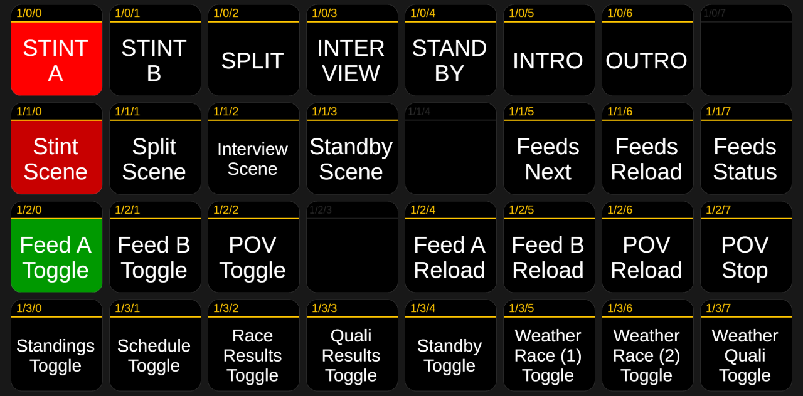
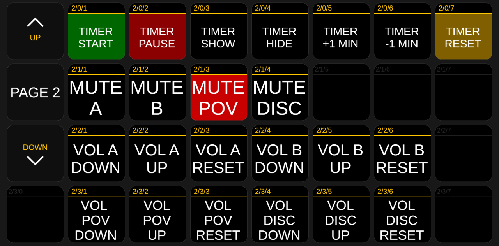

# Director guide

You direct the show **from a browser** — no OBS, no software, just the Companion buttons.
You never touch the producer's PC. Several directors can take turns, and the producer can
also direct locally.

## Getting connected

1. Make sure Tailscale is running and you've accepted the producer's invite (they set this
   up — see [Set up the broadcast PC](Set-up-the-broadcast-PC)).
2. Open **`http://<producer-tailscale-ip>:8000/tablet`** in your browser. The producer
   gives you that address.
3. The buttons now drive the show. (When a button sends a relay command, Companion runs it
   on the producer's PC for you — so it works from anywhere.)

## The button board

Two pages — **show control** and **race timer & audio**. The left column on each page
(`UP` / `DOWN`) flips between them. Everything below is a single tap.

### Page 1 — show control

| Row | Buttons |
|-----|---------|
| **Combos** | `SPLIT`, `STINT A`, `STINT B`, `INTERVIEW`, `STANDBY`, `INTRO`, `OUTRO` — one press sets a whole look (the scene **and** the right feeds and audio). `INTRO` / `OUTRO` cut to the looping intro/outro clip (with its own audio) and mute the live feeds; they light while on air |
| **Scenes + relay** | `Stint Scene`, `Split Scene`, `Interview Scene`, `Standby Scene`, `Feeds Next` (the handover), `Feeds Reload`, `Feeds Status` |
| **Feeds & reloads** | `Feed A Toggle`, `Feed B Toggle`, `POV Toggle`, `Feed A Reload` (reconnect only Feed A → `/reload/A`), `Feed B Reload` (→ `/reload/B`), `POV Reload`, `POV Stop` |
| **Graphics & weather** | `Standings`, `Schedule`, `Race Results`, `Quali Results`, `Standby Toggle` (incident cover — see [The race](#through-the-broadcast-scene--sheet-cues)), `Weather Race (1) Toggle`, `Weather Race (2) Toggle`, `Weather Quali Toggle` — the three weather buttons are full-screen Stint overlays, each an independent toggle like Standings/Results |

### Page 2 — race timer & audio

| Row | Buttons |
|-----|---------|
| **Race timer** | `TIMER START` (starts — or resumes a paused timer), `TIMER PAUSE` (freezes the remaining time on screen), `TIMER SHOW` / `TIMER HIDE` (overlay visibility), `TIMER +1 MIN` / `TIMER -1 MIN` (correction: shifts the running countdown, a paused remainder, or — before start — the race duration), `TIMER RESET` (back to the full duration). Stopwatch logic; details in [Race-Timer](Race-Timer) |
| **Mute** | `MUTE A`, `MUTE B`, `MUTE POV`, `MUTE DISC` |
| **Volume A / B** | `VOL A DOWN` / `VOL A UP` / `VOL A RESET`, `VOL B DOWN` / `VOL B UP` / `VOL B RESET` |
| **Volume POV / Discord** | `VOL POV DOWN` / `VOL POV UP` / `VOL POV RESET`, `VOL DISC DOWN` / `VOL DISC UP` / `VOL DISC RESET` |

> `VOL … UP` / `DOWN` nudge a source by ±3 dB (relative — they drift over a session);
> `VOL … RESET` snaps that source back to **0 dB** (its original level). Reset only
> touches the level, not the mute state — use the `MUTE …` buttons for that.

> Tip: for the everyday moves, use the **combo** buttons on page 1 (`STINT A`, `SPLIT`,
> `INTERVIEW`, …) — they set the scene and the audio in one tap.

How the board is imported and built: [Companion](Companion).

## Through the broadcast (scene + sheet cues)

As director you drive two things: the **scenes** (Companion) and three **HUD fields in the
shared sheet** — **Stint**, **Session**, and **Race Control**. Each is a dropdown: pick the
listed value, or clear the cell to show nothing. The whole run, in order:

**At go-live (intro)**
- The producer starts streaming on **Standby**. Press **INTRO** to play the looping intro
  clip full-screen (with its own audio). Leave it running until the field is ready, then cut
  into the show (**STINT A** / **Splitscreen** for the formation lap). This is the **Intro
  video scene** — separate from the **Stint → Intro** HUD label below.

**Before the start**
- Sheet: **Stint → Intro**, **Session → Warmup**.

**Formation lap** — the race always begins with a manual formation lap.
- Sheet: **Race Control → Formation Lap**.
- As the formation lap starts: **Stint → Stint 1**, **Session → Race**.
- Just before the green flag: **clear Race Control**.

**The race**
- Keep the **Stint** scene on the active feed.
- Need to show a weather graphic? Press **Weather Race (1) Toggle**, **Weather Race (2) Toggle** or **Weather Quali Toggle** — each
  drops a full-screen weather overlay onto the Stint scene and is an independent toggle
  (press again to hide), exactly like the Standings/Results graphics.
- At each commentator change, run the [driver-change steps](#at-a-driver-change) below.
- Want a driver's onboard as a small PiP? It needs a **few minutes of lead time** — see
  [Showing a driver POV](#showing-a-driver-pov-plan-ahead) below.
- Incident? Set **Race Control → Red Flag** or **Technical Difficulties** and press
  **Standby Toggle** to hold the picture — it hides the feeds and the POV but keeps the
  Race Control banner and timer visible (the button lights while it's active). When it's
  resolved, press **Standby Toggle** again and **clear Race Control**.

**Final lap** — once you're in the last stint and the leader starts the final lap:
- Sheet: **Race Control → Final Lap**. **Clear it** as soon as the race finishes.

**After the race — interviews**
- Sheet: **Stint → Moderator**, **Session → Interviews** — set these **before** you cut.
- Confirm the producer has joined Discord (see [Interviews](#interviews) below), then cut to
  the **Interview** scene.

**Wrap up**
- When the interviews end, cut back to **Stint** and set **Stint → Outro**,
  **Session → Wrapup**.
- For the close, press **OUTRO** — the looping outro clip plays full-screen (with its own
  audio) and stays on air. The producer can then stop streaming at any time. (**OUTRO** is
  the **video scene**; **Stint → Outro** above is the HUD label.)

## At a driver change

Every ~2 hours the commentator changes. You do this from your browser — both the Companion
buttons **and** the shared Google Sheet. Each time:

1. Cut to **Splitscreen** (covers the handover window).
2. In the sheet, set **Race Control** to **Driver Swaps** — viewers see it on the overlay.
3. Press **Feeds Next** — the off-air feed advances to the next commentator.
4. **Just before cutting back, update the sheet** for the new commentator: set the **Stint**
   and **Streamer** entries.
5. **Make sure the incoming feed is active.** Cut back with the matching combo — **STINT A**
   or **STINT B** — which selects the right feed (A or B alternate each stint) and shows the
   **Stint** scene in one press. (Cutting manually? Toggle the incoming **Feed A** / **Feed B**
   on first.)
6. Back in **Stint**, **clear the Race Control entry** in the sheet (leave it empty).

## Showing a driver POV (plan ahead)

You can show a driver's own stream as a small picture-in-picture (bottom-right) over the
active feed in the **Stint** scene ([how it works](Relay-Mode#driver-pov-pip-optional)).
The one thing to know: **it is not instant.** Between "driver goes live" and "PiP ready
on the producer's machine" the relay still has to resolve and pull the stream — so start
the chain **a few minutes before** you want it on air:

1. **Order it early:** ask the driver to start their (unlisted) live stream and send you
   the watch URL — roughly **5 minutes ahead** is comfortable.
2. **Schedule it:** paste the watch URL into the shared sheet, tab **POV**, cell **A2**.
3. **Pull it:** press **POV Reload**. The relay re-reads the cell and starts pulling.
   Resolving a live stream takes ~10–30 seconds; if the driver is **not live yet**, the
   relay simply keeps retrying every 15 seconds until they are — no harm, but nothing to
   show either.
4. **Verify it's ready:** open `http://<producer-tailscale-ip>:8088/status` in a browser
   tab — the `pov` block must say `"state": "serving"`. (`connecting` means it's still
   resolving or the driver isn't live yet — don't show it; the PiP would be black.)
5. **Show it:** press **POV Toggle** — allow a couple of seconds for OBS to connect the
   first time. Audio is muted by default; **MUTE POV** / **VOL POV …** (page 2) if you
   want it audible.
6. **Done:** **POV Toggle** to hide, then **POV Stop** (frees the pull / bandwidth).

Two rules: **Reload before Toggle**, and **hide + POV Stop when done**. The PiP lives only
in the Stint scene — switching to Splitscreen/Interview/Standby auto-hides and
auto-silences it.

## Interviews

Interviews are over Discord voice. **Before** you cut to the Interview scene, confirm the
**producer has joined the Discord "Interviews" voice channel** — the audio comes from the
producer's local machine, so you can't join for them. Then switch to **Interview**, show
the lower-third, and manage mutes as guests speak.

---

New to the team? → [Who does what](Who-does-what). Something off? →
[If something goes wrong](If-something-goes-wrong).
