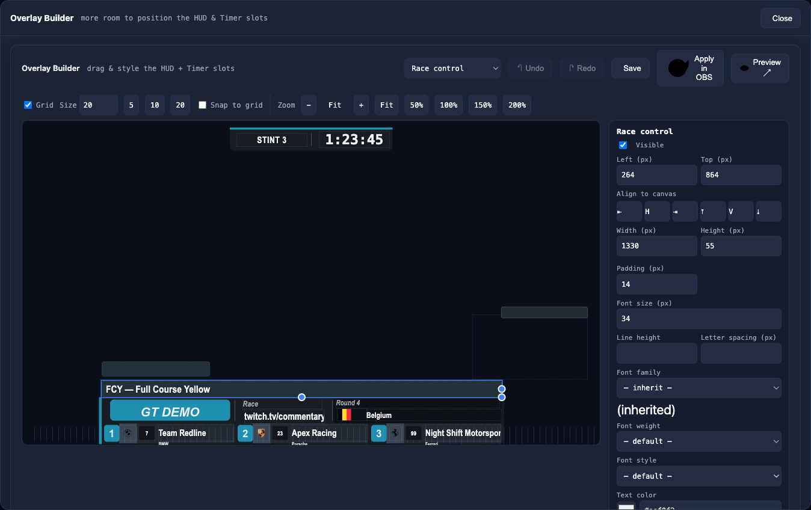

# HUD overlays

> New here? The visual [Overlay Package Designer deck ↗](https://jegr78.github.io/gt-endurance-racing-broadcast/overlay-designer.html) walks the builder + live preview; this page is the operator reference.

> Operator reference for restyling the on-screen HUD (including the race timer) per league.
> Profiles in general are covered in [League profiles](Profiles).

The relay serves the lower-third **HUD** — which **includes the race timer** — as one
shared page, the same `hud.html` for every league. A league can **restyle** it — reposition
elements, change fonts and colors — **without forking** the page, by shipping a small CSS
override (and optional fonts) in its profile.

## Where it lives

A league's overlay styling sits in its profile folder:

```
profiles/<name>/overlay/hud.css           # restyle the HUD (incl. the race timer)
profiles/<name>/overlay/intermission.css  # restyle the Intermission broadcast-chat panel
profiles/<name>/overlay/fonts/            # optional custom font files
```

`profiles/example/overlay/` ships as a commented template. All CSS files are **optional**:
an empty or missing file means the base look is used unchanged.

## How it works

The base `hud.html` and `intermission.html` stay shared. The relay serves the active
league's CSS at fixed paths:

- **`/hud/override.css`** ← `profiles/<name>/overlay/hud.css`
- **`/intermission/override.css`** ← `profiles/<name>/overlay/intermission.css`

Each base page links its override **last** in `<head>`, so any rule in the league CSS
**wins the cascade** over the page's own styles. The CSS is read **per request**, so editor
saves apply without restarting the relay (with one first-time caveat below).

Custom fonts are served at **`/overlay/fonts/<file>`** from `profiles/<name>/overlay/fonts/`.
Reference them with a normal `@font-face`:

```css
@font-face { font-family: "League"; src: url(/overlay/fonts/League.woff2); }
```

## Overridable elements

The base HUD (`hud.html`, a 1920×1080 canvas, elements positioned from the top-left)
exposes these ids:

| Id | Element |
|---|---|
| `#stint` | the stint / label line |
| `#session` | the session line |
| `#streamer` | the commentator/streamer line |
| `#round-top` | the round header |
| `#round-flag` | the round country flag image |
| `#round-country` | the round country text |
| `#team0` `#team1` `#team2` | the three team rows (each holds a logo image + a `.name` span) |
| `#race-control` | the race-control line |
| `#clock` | the race-timer digits (merged into the HUD) |
| `#pov` | the POV picture-in-picture frame (position + background/border) |
| `#pov-name` | the POV on-screen name label (free text from the POV tab's `name` column) |

The POV box (frame + name) is shown only while the POV PiP is toggled on (driven by the
relay's `pov_shown`, via `/hud/data` `povActive`).

## Editing — the visual builder

In the Control Center's **Profile** view, the **Overlay Builder** lays out every HUD slot
visually on one canvas — the lower third, the **race timer** clock and the **POV** frame
together — no CSS required. Click a slot to select it, drag it to reposition, drag the
corner/edge handles to resize, and set position, font, color, background (and, for the POV
box, border style/color/width) in the property panel. The fields **pre-fill** with each
slot's current template values, so you always see real numbers to adjust from. **Pop out ↗**
opens the builder in a larger modal over the Control Center; **Save** writes the files;
**Apply in OBS** reloads the browser source (the same as `racecast obs refresh`);
**Preview ↗** opens the live HUD preview at `/hud/preview` (the real base page with
live Sheet data over your `Overlay.png` frame).



The canvas renders the real base page with **sample data** over your league's
`Overlay.png` frame, so you position against the actual broadcast graphic. The per-slot
**font** dropdown (and a global body font) offers the league's own uploaded fonts plus the
machine-wide **font library** (see below); a profile-specific font can also be uploaded
under **Fonts & advanced CSS**, where **advanced CSS** is a raw escape hatch appended
verbatim after the generated rules.

### Fonts: a machine-wide library

A curated set of broadcast-friendly Google Fonts **ships with every install** and is
offered in the Overlay Builder's font pickers — no download step. To use a family that
is not in the set, type its name in **General Settings → Overlay fonts** (or open the
**Browse Google Fonts** link to find the exact name); it is self-hosted once into the
machine-wide library (`runtime/fonts/`) shared across all leagues — no per-league
re-download. When a league's design uses a font, it is copied into that league's
`overlay/fonts/` on save, so the overlay works offline and **profile export** stays
self-contained.

How it round-trips: the builder owns a `layout-<page>.json` model and **compiles** it into
the same `profiles/<name>/overlay/<page>.css` the relay serves — so everything below about
the cascade still holds. A profile's existing **hand-written** `<page>.css` is imported
verbatim into the advanced-CSS box the first time you open the builder (nothing is lost),
and your visual changes compile **above** it.

> **First-override caveat.** The relay only watches a profile's `overlay/` directory when
> that directory **existed at the moment the relay started** (the relay is launched with
> `--overlay-dir` only when the dir is present). So the **very first** override on a profile
> whose `overlay/` did not exist yet needs **one `racecast relay restart`** to activate.
> After that, later edits apply live via **Apply in OBS** — no restart.

> **CLI alternative:** edit `profiles/<name>/overlay/hud.css` in any text editor,
> drop fonts in `profiles/<name>/overlay/fonts/`, then `racecast obs refresh`. (Editing the
> CSS by hand and using the visual builder on the same profile both work — the builder
> imports your hand-written CSS into its advanced-CSS box, then owns the generated file.)

## Example `hud.css`

```css
/* Move the stint line and restyle race control */
#stint        { left: 800px; top: 30px; font-size: 44px; }
#race-control { background: #222a2f; }

/* Custom font (drop the file in overlay/fonts/ first) */
@font-face { font-family: "League"; src: url(/overlay/fonts/League.woff2); }
html, body { font-family: "League", "Arial Narrow", sans-serif; }
```

## OBS collection naming

Per-league overlay styling pairs naturally with a per-league OBS scene collection. The
naming convention is **`GT Endurance Racing — <league>`** (set via the profile's
`OBS_COLLECTION`); switch OBS to it with `racecast obs collection set`. See
[League profiles](Profiles) and [OBS & scenes](OBS-Setup).

---

> This page is generated from `src/docs/wiki/` in the
> [main repository](https://github.com/jegr78/gt-endurance-racing-broadcast) — don't edit it
> here by hand. See [Build & maintenance](Build-and-maintenance).
