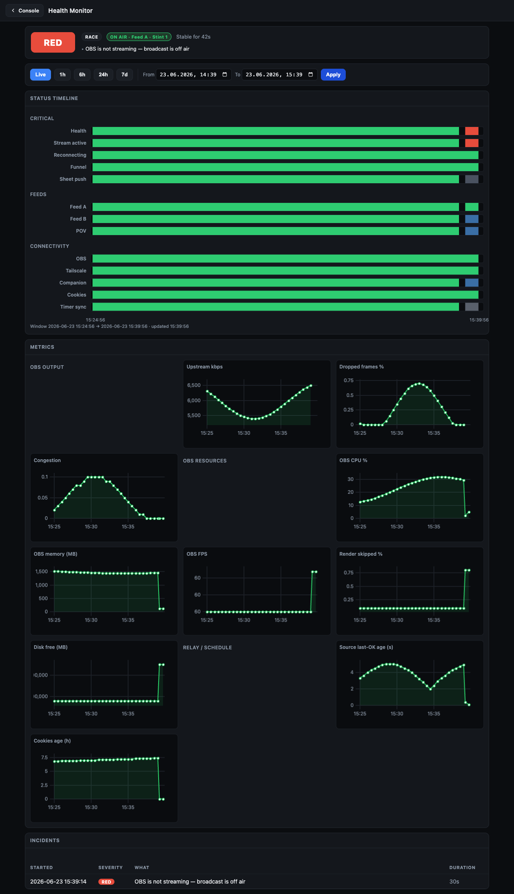

# Health Monitor



The **Health Monitor** is a read-only dashboard served by the relay that lets any
authenticated crew member see how the relay has been performing — live and over time.
It is a passive observer: it never changes what is on air or pings Discord.

## How to open it

**From the `/console` launcher** — the recommended path. Any crew member who has
signed in to the [Console](Console) launcher sees a **Health Monitor** card; clicking
it opens `/console/health-monitor` over the Funnel (public HTTPS) or the tailnet,
depending on how you reached the Console. No extra password or role is required — the
same token that opens your cockpit or the director panel also opens the Health Monitor.

**Direct tailnet access** — on the tailnet, `http://<tailscale-ip>:8088/health-monitor`
also works. The page is not exposed publicly on its own; only `/console` (including
`/console/health-monitor`) is Funnel-mounted.

> **Access level:** any authenticated `/console` subject — commentators, directors,
> Race Control, producers — can open it. It is read-only and triggers no broadcast
> actions.

## What the dashboard shows

### Aggregate health badge

A large green / yellow / red badge at the top of the page reflects the relay's
**current aggregate health**. Below it, any active reasons (e.g. "Feed A stalled",
"cookies expiring soon") appear as a short list.

### Status-band timelines

Horizontal bands show the health history for each subsystem across the selected
time range. Each band is coloured green / yellow / red per sample period.

The bands are grouped into three sections:

#### Critical

These bands can drive the aggregate health level to red. A problem here is always
visible to the whole crew through the aggregate badge.

| Band | What it tracks |
|---|---|
| **Health** | Aggregate relay health (the badge above, over time) |
| **Stream active** | Whether OBS is actively streaming to the broadcast platform. Red (and alerting) only once OBS has streamed at least once this session and then stops — so a live broadcast dropping off air pages, but starting the relay before you go live does not. |
| **Reconnecting** | Whether the OBS output is in a reconnect loop. Yellow when reconnecting. |
| **Funnel** | Whether Tailscale Funnel is up (required for `/console` to be reachable publicly). Red when expected but down. |
| **Sheet push** | Whether the relay's last write to the Google Sheet webhook succeeded. Yellow on repeated failure. |

#### Feeds

| Band | What it tracks |
|---|---|
| **Feed A** | Whether Feed A was streaming or stalled |
| **Feed B** | Whether Feed B was streaming or stalled |
| **POV** | Whether the POV feed was active |

#### Connectivity

These are **observational** — a problem here turns yellow and is noted, but it does not
necessarily drive the aggregate to red on its own.

| Band | What it tracks |
|---|---|
| **OBS** | Whether the relay could reach OBS via obs-websocket |
| **Tailscale** | Whether this machine's Tailscale node is up |
| **Companion** | Whether Bitfocus Companion is reachable on its control port |
| **Cookies** | YouTube-cookie freshness (approaching expiry = yellow; expired = red) |
| **Timer sync** | Whether the race-timer push to the Sheet is succeeding |

> **Critical vs. observational:** Critical bands (`stream_active`, `funnel_ok`,
> `sheet_push_ok`, `stream_reconnecting`) contribute to the aggregate health level when
> they fault. Connectivity bands (`tailscale_up`, `companion_ok`, `obs_reachable`) are
> informational — they record what happened without necessarily escalating the aggregate.
>
> **Off-air alarm latches on the first stream:** the off-air CRITICAL only fires after
> OBS has gone live at least once this relay session and *then* stops streaming — so a
> live broadcast that drops off air pages the crew, while simply starting the relay
> before the show never sends a confusing pre-show ping. (The **Stream active** band
> itself still shows the honest current state; it is the aggregate health + Discord
> alert that wait for the latch.)

### Numeric line charts

Line charts plot scalar metrics over time, grouped by subsystem:

#### OBS Output

| Chart | What it tracks |
|---|---|
| **Upstream kbps** | Outgoing stream bitrate reported by OBS |
| **Dropped frames %** | Percentage of frames dropped by the OBS encoder or network |
| **Congestion** | OBS output congestion score (0–1; higher = more back-pressure) |

#### OBS Resources

| Chart | What it tracks |
|---|---|
| **OBS CPU %** | CPU usage of the OBS process |
| **OBS memory (MB)** | OBS process resident memory in megabytes |
| **OBS FPS** | Rendered frames per second reported by OBS |
| **Render skipped %** | Percentage of frames skipped by the OBS renderer |
| **Disk free (MB)** | Free disk space on the OBS recording drive |

#### Legacy series (always present)

| Chart | What it tracks |
|---|---|
| **Sheet source age** | Seconds since the schedule/overlay sheet was last successfully read |
| **Cookie age** | Age of the YouTube cookies file in seconds |

> **Synthetic / no-OBS mode:** when OBS is not reachable (obs-websocket unavailable),
> the OBS Output and OBS Resources series are empty. The charts render but show no data
> points — that is correct and expected before an event when OBS is not yet open.

### Incident timeline

Below the charts, a list of **incidents**: moments when the aggregate health dropped
to yellow or red, with a start time, end time (or "ongoing"), duration, and the
reasons that were active. Each incident is a single row; open it for the full
reason list at that moment.

## Time-range controls

Preset buttons at the top of the page select the window to display:

| Control | Window |
|---|---|
| **Live** | The most recent ~5 minutes, auto-refreshing |
| **1h** | Last 1 hour |
| **6h** | Last 6 hours |
| **24h** | Last 24 hours |
| **7d** | Last 7 days |
| **Custom** | A from–to date-time picker |

The page does not auto-refresh outside Live mode; hit the browser refresh to update a
historical view.

## Persistence and retention

The relay samples its own health every ~30 seconds into a per-profile SQLite database
at `runtime/<profile>/health-history.db`. Samples are retained for **30 days** by
default; set `RACECAST_HEALTH_RETENTION_DAYS` in your `.env` to a different number.
The history belongs to the active profile — switching profiles shows the new profile's
own history.

## Export, import, and producer handover

History can be moved between machines as a [JSON Lines](https://jsonlines.org/) file:

```
racecast health export [--from TS] [--out PATH]   # dump history to a .jsonl file
racecast health import <file.jsonl>               # merge a dump into the local DB (dedup by ts)
racecast health pull <ip> [--port N] [--from TS]  # pull another producer's history over the tailnet
```

During `racecast event takeover`, health history is pulled automatically from the
outgoing producer — the same pattern as `chat pull` and `console pull-versions`. The
`--funnel` takeover path also carries health over the step-up-authenticated
`/console/takeover/health` endpoint.

## Setup

No setup is required. The Health Monitor is active whenever the relay is running —
there is no enable/disable command. The SQLite database is created automatically on
the first relay start.

The dashboard depends on no external services: it reads only from the local DB and the
relay's live `/health-monitor/data` endpoint. The charting library
([uPlot](https://github.com/leeoniya/uPlot), MIT licence) is bundled with the relay
(`src/assets/vendor/uplot/`) — no internet connection is needed to render the charts.

---

> This page is generated from `src/docs/wiki/` in the
> [main repository](https://github.com/jegr78/gt-endurance-racing-broadcast) — don't edit it
> here by hand. See [Build & maintenance](Build-and-maintenance).
