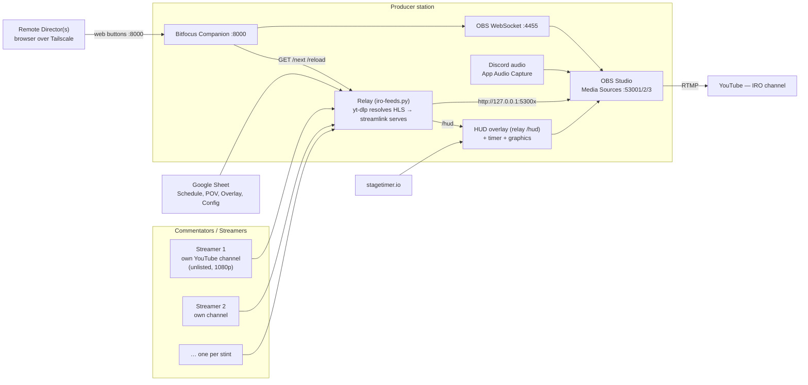

# IRO Endurance Broadcast

Welcome to the operator wiki for the **IRO Endurance** sim-racing broadcast station.

This is the onboarding and reference hub for everyone who runs, directs, or streams
for the show. It is generated from the `src/docs/` material in the
[main repository](https://github.com/jegr78/IRO_Broadcast_Setup) — **do not edit pages
here by hand**; edit `src/docs/wiki/` in the repo and run `tools/sync-wiki.py`
(see [Maintaining this wiki](Maintaining-this-Wiki)).

## What this is

A self-contained broadcast-production setup run on one producer station (Windows or
macOS). Commentator
game streams are pulled straight into OBS with a memory buffer, overlays are switched
locally, and a remote director controls everything from a browser. The producer only
starts and stops the main broadcast.

## Start here

- **New to the show?** Read [Architecture](Architecture) to understand the moving parts.
- **Setting up a producer station?** Follow [Installation](Installation) →
  [Configuration](Configuration) → [OBS Setup](OBS-Setup) →
  [Companion](Companion) in order.
- **Running an event?** Jump to the [Runbook](Runbook).
- **Something broke?** See [Troubleshooting](Troubleshooting).
- **You're a streamer/commentator?** Read [Roles &amp; Requirements](Roles).

## Pages

| Page | What it covers |
|------|----------------|
| [Architecture](Architecture) | How it all fits together — the four diagrams |
| [Installation](Installation) | Install every tool on the producer station (Tailscale, OBS, Companion, Streamlink…) |
| [Configuration](Configuration) | `.env`, the Google Sheet ID, `setup-assets.py`, secrets |
| [OBS Setup](OBS-Setup) | Import the scene collection, Media Sources, HUD, Discord audio |
| [Relay Mode](Relay-Mode) | The recommended endurance flow: 2-feed ping-pong + POV PiP + cookies |
| [Static Mode](Static-Mode) | The simpler fallback for public/fixed channels |
| [Companion](Companion) | The director button board + relay control endpoints |
| [Director (Remote)](Director) | Remote directing over Tailscale + backup director panel |
| [Runbook](Runbook) | Step-by-step before / during / after an event |
| [Troubleshooting](Troubleshooting) | Symptom → fix table |
| [Roles &amp; Requirements](Roles) | What streamers, producer and director each do |
| [Maintaining this Wiki](Maintaining-this-Wiki) | How these pages are generated and pushed |
