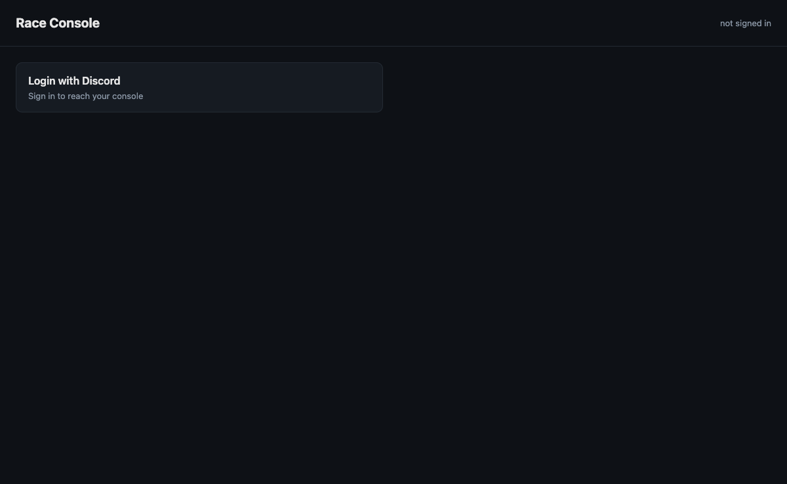

# League-Owner Setup — Discord OAuth

This page covers what the **league owner** (the person who owns the Discord server and
maintains the league's crew list) needs to do once to enable Discord OAuth login for
`/console`.

With Discord OAuth configured, crew members open a single generic URL
`https://<magicdns>/console` and click **Login with Discord**. The relay matches their
Discord username against the Crew tab and resolves their role. Signed `racecast links`
remain available as a fallback — see [Console](Console) for the role model and the
Funnel boundary.



---

## Steps

### 1. Create a Discord Application

1. Go to [discord.com/developers/applications](https://discord.com/developers/applications)
   and click **New Application**.
2. Give it a name (e.g. `GT Endurance Racecast`) — this is what crew members see on the
   OAuth consent screen.
3. In the left sidebar, open **OAuth2**.
4. Copy the **Client ID** and **Client Secret** (reset it if you can't see the value).

> **Application type:** this is a plain OAuth2 app, not a bot. You do not need to
> enable any bot permissions or invite it to your server. The only scope used is
> `identify` (read the user's Discord username — no messages, no guilds).

### 2. Add the credentials to `profile.env`

Open `profiles/<league>/profile.env` and add:

```ini
DISCORD_CLIENT_ID=<your-client-id>
DISCORD_CLIENT_SECRET=<your-client-secret>
```

These travel with `racecast profile export` (like `CONSOLE_SECRET`), so a new producer
who imports the bundle is immediately ready.

When either key is absent the relay starts without Discord OAuth: the `/console` login
button is not shown, and signed `racecast links` are the only entry path.

### 3. Register redirect URIs in the Discord app

Discord requires an **exact** URI match for every producer host that will receive OAuth
callbacks.

For each machine that runs the relay with Funnel enabled, add one redirect URI:

```
https://<magicdns>/console/oauth/callback
```

where `<magicdns>` is that machine's Tailscale MagicDNS hostname (e.g.
`producer.tailnet.ts.net`). `racecast links` prints the exact URI for the active
machine.

To add a URI: in the Discord Developer Portal → **OAuth2** → **Redirects** → paste the
URI → **Save Changes**. Add one line per producer host; Discord rejects any host not
on the list.

### 4. Maintain the Crew tab

The relay resolves roles from the Google Sheet's **Crew tab**. The tab header must be:

```
Name | Commentator | Director | Producer | Discord
```

- **Name** — the person's display name (used in chat, tally, and links).
- **Commentator** — flag (`TRUE`/`FALSE` or `1`/`0`); grants Commentator Cockpit access.
  Commentator role is also granted automatically to anyone who appears in the live Race
  Schedule (the `Commentator` column covers pre-event / reserve commentators who are not
  yet on the schedule).
- **Director** — flag; grants Director Panel + Web Buttons access.
- **Producer** — flag; reserved for future producer-level capabilities.
- **Discord** — the Discord **username** (not display name, not `@mention`). Fill this
  for everyone who will log in with Discord. Case is ignored on match.

A person with no Discord handle in the Crew tab cannot log in with Discord — the relay
finds no match and returns HTTP 403.

### 5. Share the generic console URL

Post the single URL in your crew channel:

```
https://<magicdns>/console
```

This URL carries no identity — it is broadcast-safe. Each crew member clicks it, goes
through Discord's standard OAuth consent screen (one-time, then cached), and lands on
their personalised console with the cards for their role.

Signed `racecast links` (one URL per person) remain the fallback for:
- last-minute guests who are not in the Crew tab,
- productions where Discord OAuth is not configured,
- crew members who prefer a direct link without the OAuth step.

### 6. Revocation

Two independent revocation mechanisms exist:

| What you want to revoke | Mechanism |
|---|---|
| **A person's access** (Discord login AND signed links) | Remove or blank their `Discord` cell and all role flags in the Crew tab. Role resolution runs on every request — the change takes effect immediately with no relay restart. |
| **A leaked signed link** (without locking the person out) | Run `racecast cockpit token revoke <name>`. This bumps the version in `console-versions.json`; old signed links are rejected on next use. The person can still log in fresh with Discord. |

---

## Troubleshooting

**"redirect_uri did not match"** — the URI in the Discord app does not exactly match the
one the relay sent. Check for trailing slashes, `http` vs `https`, and the correct
MagicDNS hostname. `racecast links` prints the exact URI the relay uses.

**Crew member gets 403 after login** — their Discord username in the Crew tab does not
match. Check for spaces, dots, and capitalisation (the relay normalises to lower-case, but
the stored value must otherwise be an exact username match).

**Login button not shown** — `DISCORD_CLIENT_ID` or `DISCORD_CLIENT_SECRET` is missing
from `profile.env`, or the relay was started before the keys were added (restart the
relay after adding them).

---

## Further reading

- [Console](Console) — the role model, the Funnel boundary, and the card structure.
- [Remote access & the Funnel boundary](Remote-access) — security model, Funnel mount,
  and Tailscale MagicDNS setup.
- [Configuration](Configuration) — `profile.env` keys reference.
- [Who does what](Who-does-what) — role definitions.

---

> This page is generated from `src/docs/wiki/` in the
> [main repository](https://github.com/jegr78/gt-endurance-racing-broadcast) — don't edit it
> here by hand. See [Build & maintenance](Build-and-maintenance).
