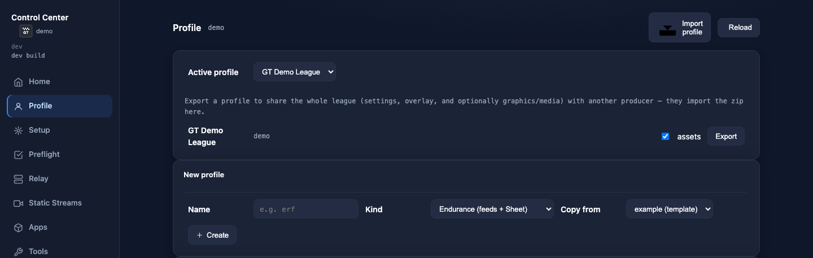
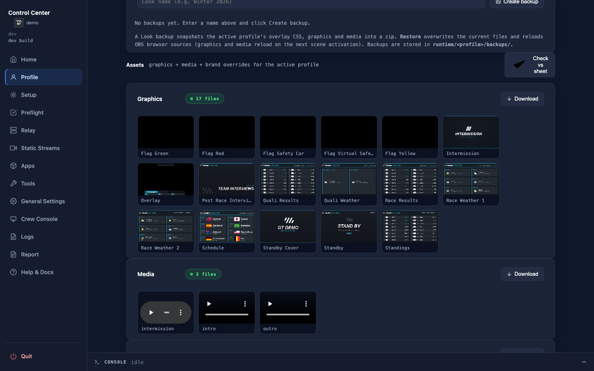

# League profiles

> Operator reference. The config keys these set are detailed in
> [Configuration & secrets](Configuration); the per-league overlay look is in
> [HUD overlays](HUD-Overlays).

One machine can run **several leagues**. Each league is a **profile** — a self-contained
folder with its own Google Sheet, broadcast graphics/media, OBS scene collection and
overlay look. Switching leagues is a one-command profile switch; you never edit `.env` or
the OBS collection to change leagues.

## What a profile is

A profile lives in `profiles/<name>/`. Its config is the file
`profiles/<name>/profile.env`, with **un-prefixed** keys (the file *is* the league — real
environment variables and the machine `.env` do **not** override these). Two profiles
ship with the toolkit: `profiles/example/` is the copy-from template (filtered out of the
league list), and `profiles/demo/` is a **directly-usable** league pointing at a public,
read-only demo Sheet — `racecast profile use demo` runs it out of the box (see
[Sheet template](Sheet-Template)).

```ini
# profiles/<name>/profile.env
NAME=My League
SHEET_ID=
SHEET_PUSH_URL=
INTRO_URL=
OUTRO_URL=
LOGO=
OBS_COLLECTION=
# optional Discord integration
DISCORD_CLIENT_ID=
DISCORD_CLIENT_SECRET=
DISCORD_WEBHOOK_URL=
```

| Key | Meaning |
|---|---|
| **`NAME`** | Display name shown in the CLI / Control Center / docs (not the HUD). |
| **`SHEET_ID`** | The long ID from the league's HUD/schedule sheet URL (`…/spreadsheets/d/`**`<THIS>`**`/edit`). Drives the relay: stint schedule, POV tab, and the HUD overlay — full tab/column layout in [Sheet template](Sheet-Template). Reopen the sheet anytime with **Open Sheet ↗** (Profile view) or `racecast sheet open`. |
| **`SHEET_PUSH_URL`** *(optional)* | The Apps Script write webhook (the `/exec` URL **including** its `?key=…` secret) shared by the race timer and the director panel's sheet controls. Unset = those write-backs are read-only. See [Sheet-Webhook](Sheet-Webhook). |
| **`INTRO_URL` / `OUTRO_URL`** *(optional)* | Override the Intro/Outro clip URLs that normally come from the Sheet's Assets tab (used by `racecast media`). |
| **`LOGO`** *(optional)* | A logo image (path relative to the profile dir) for the Control Center. |
| **`OBS_COLLECTION`** *(optional)* | The OBS scene-collection name this league uses, so several leagues keep separate collections in OBS on one machine. Blank = the per-league convention `GT Endurance Racing — <league>`. |
| **`CONSOLE_SECRET`** *(auto-managed)* | The per-league secret signing the `/console` crew tokens; **auto-generated on first relay start** and shared across a league's producers via export/import — never set it by hand. See [Configuration](Configuration) and [Remote access](Remote-access). |
| **`DISCORD_CLIENT_ID` / `DISCORD_CLIENT_SECRET`** *(optional)* | Per-league Discord **OAuth app** credentials. Both set → crew can sign in to the [Console](Console) with Discord (matched to the Crew tab's `Discord` column); absent → signed `racecast links` are the only entry path. Setup: [Console & cockpit setup](Console-Setup). |
| **`DISCORD_WEBHOOK_URL`** *(optional)* | A Discord **channel webhook** (not the OAuth app). Set → the relay posts stream-link submissions and health alerts there; absent → those pings are no-ops. Setup: [Console & cockpit setup](Console-Setup). |

A profile folder also holds the league's overlay CSS (`overlay/`, see
[HUD overlays](HUD-Overlays)); its downloaded graphics and media live under
`runtime/<name>/`, not in the profile folder.

## Machine config vs. league config

Two kinds of config live in two different places — keep them straight:

- **League (per profile)** — everything in `profiles/<name>/profile.env` above. This is the
  league.
- **Machine (shared)** — a handful of optional, machine-only switches in the gitignored
  `.env` at the repo (or package) root: `RACECAST_OBS_WS_PASSWORD`,
  `RACECAST_COMPANION_EXE` (Windows), `RACECAST_UI_PORT`, `RACECAST_PROFILE` (the default
  active league), and `RACECAST_UI_PASSWORD` (reserved, not yet read). These apply to the
  machine regardless of which league is active.

Some state is **shared across leagues** and lives at the machine level: the **cookies**
(`yt-cookies.txt` for YouTube, `twitch-cookies.txt` for gated Twitch feeds) and the
`runtime/active-profile` pointer (which league is current).
**Per-league** state — downloaded graphics, intro/outro media, the localized OBS import —
lives under `runtime/<name>/`.

## The CLI

```bash
racecast profile list                          # which leagues exist (★ = active)
racecast profile show                          # the active league's resolved config
racecast profile use <name>                    # make it the active league
racecast profile new <name> --from example     # copy a profile dir to start a new league
```

`racecast profile new <name>` copies `profiles/example/` (or another profile via
`--from <src>`) into `profiles/<name>/`. `--from` defaults to `example`. The name you
type may contain spaces and capitals — e.g. `racecast profile new "Demo League"`: it is
slugged into the directory name (`profiles/demo-league/`) and kept verbatim as the league
display `NAME` in the new `profile.env`. Use that slug for `profile use` / `--profile`.

A global **`--profile <name>`** flag runs a single command against a non-active league
without switching:

```bash
racecast --profile otherleague relay start
```

**Which profile is active** (resolution order):

1. the `--profile <name>` flag (highest);
2. then `RACECAST_PROFILE` (a real environment variable, or the machine `.env`);
3. then the `runtime/active-profile` pointer (set by `racecast profile use`);
4. and if you keep **exactly one** profile, it is selected implicitly.

With several profiles and none of the above set, the CLI asks you to choose one.

## Add a second league

```bash
racecast profile new <name> --from example   # copy the template into profiles/<slug>/
# edit profiles/<slug>/profile.env — fill in SHEET_ID, (optional) SHEET_PUSH_URL, … (NAME
# is already set from the name you typed)
racecast profile use <slug>                  # make it active
```

Then run the per-league setup steps for it — `racecast graphics`, `racecast media`,
`racecast setup` — exactly as for the first league. They all act on the active profile.

## Per-league OBS collection

Each profile gets its own localized OBS import file at
`runtime/<name>/GT_Endurance.import.json`, named after the profile's `OBS_COLLECTION`
(blank = the league's `NAME`). The per-league naming convention is
**`GT Endurance Racing — <league>`**, so OBS can hold a separate scene collection per
league on one machine. After importing, switch OBS to a league's collection with:

```bash
racecast obs collection set
```

`racecast event start` auto-switches OBS to the active profile's collection by default,
so a prior league's collection can't linger on a shared box — it is safe because OBS
refuses a switch while an output is active. Set `RACECAST_OBS_COLLECTION_SWITCH=0` for
the old warn-only behaviour. The manual `racecast obs collection set` (above) and the
Control Center OBS-row button remain the explicit fallback; a switch rebuilds every
source. See [OBS & scenes](OBS-Setup).

## Onboard a new producer

To hand a league to another producer (or to set up the same league on a second machine),
use the profile export/import path.

**On the source machine:**

```bash
racecast profile export <name>              # writes <name>-profile.zip in the current directory
racecast profile export <name> --no-assets  # omit graphics/media/brands (re-fetchable on the target)
racecast profile export <name> --out /tmp/my-league.zip   # custom output path
```

The bundle contains the entire `profiles/<name>/` tree — `profile.env` (including
`SHEET_PUSH_URL` **and the auto-generated `CONSOLE_SECRET`**, so the new producer shares the
league's crew-token secret), overlay CSS, any logo — and, unless `--no-assets`, the runtime
`graphics/`, `media/`, and `brands/` for that profile. Send the zip to the other producer by any
means (file share, USB drive, etc.).

> **Compatibility note:** a bundle that includes a `brands/` section requires a build at
> the same version or newer to import. Older builds will reject the bundle with an
> "unexpected entry in bundle" error; re-export with `--no-assets` if you need to import into an
> older installation, then run `racecast brands` on the target to re-fetch the logos.

**On the target machine:**

```bash
racecast profile import my-league.zip      # extracts into profiles/<slug>/
racecast profile use <slug>                # make it active (printed at the end of import)
```

If a profile with the same slug already exists, the import prints an error; add
`--force` to replace it. After importing, the CLI prints the `racecast profile use
<slug>` hint — the active profile is **not** switched automatically.

If the bundle was exported without assets (or the graphics/media/brands have since changed),
re-fetch them on the target machine:

```bash
racecast graphics    # download broadcast graphics from the sheet
racecast media       # download Intro/Outro clips
racecast brands      # download per-league brand-logo overrides from the sheet
```

**Control Center alternative:** in the Profile view, click **Import profile** and pick
the zip file. Each profile row has an **Export** button with an **assets** checkbox
(checked by default). Re-importing a name that already exists prompts "Replace it?".



The Profile view also shows a **Graphics**, **Media**, and **Brands** download card so you can re-fetch any of the three asset sets without the CLI:



## The Control Center Profile view

The Control Center's **Profile** view exposes all of the above in one place: a switcher
for the active league, a **New profile** dialog that copies an existing profile, a
`profile.env` editor (with masked secrets), the per-league **overlay-CSS** editor (HUD and
Timer — see [HUD overlays](HUD-Overlays)), and the profile-scoped graphics/media/brands. Each
profile row has an **Export** button (with an **assets** checkbox) and the card header
has an **Import profile** button — see [Onboard a new producer](#onboard-a-new-producer)
above.

> **CLI alternative:** the `racecast profile …` verbs above, plus `racecast graphics` /
> `racecast media`. Edit `profiles/<name>/profile.env` in any text editor.

---

> This page is generated from `src/docs/wiki/` in the
> [main repository](https://github.com/jegr78/gt-endurance-racing-broadcast) — don't edit it
> here by hand. See [Build & maintenance](Build-and-maintenance).
