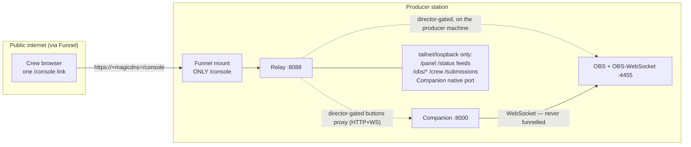

# Remote access & the Funnel boundary

> How the crew — commentators, directors and a takeover producer — reach the show
> from anywhere, and the security boundary that keeps everything else private.
> The talent specifics live in [Commentator Cockpit](Commentator-Cockpit); the
> panel specifics in the [Director guide](Director).

Everyone who helps run an event gets **one personal link**. Opening it lands them on
`/console` — a single role-adaptive page that shows exactly the surfaces their role
allows and nothing else. The same link works whether they are on the tailnet or coming
in over the public internet. See the [Console launcher](Console) page for a card-by-card overview.

## The default: the public Funnel

**The standard way crew connect is the public Tailscale Funnel.** One producer command —
`racecast funnel on` — publishes the `/console` page at `https://<magicdns-host>/console`,
and from then on a commentator, a remote director, or a takeover producer just opens their
link in any browser. **They need no Tailscale account and nothing installed** — which is
the whole point: more people can help without each joining the tailnet (and it stays inside
the Tailscale free tier).

Being **directly on the tailnet** is the *alternative*, kept for the producer's own trusted
devices (the producer's PC, a second machine, a phone with the Tailscale app). On the
tailnet the same surfaces are reachable at their root paths (`/panel`, `/cockpit`, …) over
the producer's Tailscale IP. The relay binds `--bind auto` — loopback for OBS plus the
Tailscale IP when present — so the local OBS/Companion workflow never changes.

```bash
racecast funnel on     # publish ONLY /console publicly (https://<magicdns-host>/console)
racecast links         # print one /console link per person (Crew tab ∪ live Schedule)
racecast funnel off    # take it back off the public internet
```

The one-time tailnet prerequisites (MagicDNS, HTTPS, the `funnel` nodeAttr) and the
optional `racecast cockpit setup-funnel` automation are documented once, on the
[Commentator Cockpit](Commentator-Cockpit#public-access-via-tailscale-funnel--one-time-setup)
page.

## One link, every role

A person can be a **commentator AND a director AND/OR a producer** at the same time, and
roles can change per event. So there is **one link per person**, not one per role. The link
carries a signed **identity** token; the relay looks up *what that person may do right now*
on every request.

- **Identity (the token).** `<subject>.<version>.<sig>` — the person's normalised name, a
  rotation counter, and an HMAC signature. It proves *who* you are, nothing more. It rides
  in the link once, then moves into an `HttpOnly; Secure; SameSite=Lax` cookie.
- **Authorization (looked up live).** The relay resolves *who may do what* per request from
  the league **Crew** tab (`Name | Director | Producer`) **unioned with the live Schedule**
  (anyone scheduled to commentate has the commentator capability for their own stints). Edit
  roles in the Control Center **Crew editor** (or the Sheet's Crew tab) and they apply
  immediately — no link re-issue. See [Sheet-Webhook](Sheet-Webhook#crew) for the Crew tab
  + Apps Script action.
- **Rotation.** `racecast cockpit token revoke "<name>"` bumps that person's version, so
  their old link stops working at once — nobody else is affected and no secret is rotated.

All tokens are signed with one **per-league secret**, `CONSOLE_SECRET`, auto-generated in
the active profile's `profile.env` on first relay start and carried by
`racecast profile export`/import. (See [Configuration](Configuration); the
legacy key name `COCKPIT_SECRET` is still read as a fallback.)

## The `/console` launcher — role-adaptive

`/console` renders only what the signed-in person's roles permit:

| Surface | Reached at | Who sees it |
|---|---|---|
| **Launcher** | `/console` | any authenticated person — links onward to the surfaces below |
| **Commentator Cockpit** | `/console/cockpit` | any authenticated person (program monitor, tally, chat, timer, submit own stint) |
| **Director Panel** | `/console/panel` | directors — the full show panel (scenes, feeds, audio, timer, HUD, URLs) |
| **Producer takeover** | `/console/takeover/*` | a takeover producer, with the step-up secret (below) |

`/console/whoami` returns the resolved identity + roles for the current token (used by the
page to decide what to show). The cockpit and panel pages are the *same* pages as the
tailnet `/cockpit` and `/panel`; under `/console` their API calls are transparently routed
to the role-gated mirror endpoints.

## What each role may do

| Capability | Endpoints (role-gated) | Minimum role |
|---|---|---|
| Read status / HUD / schedule / program monitor / timer | `/status`, `/hud/data`, `/schedule/data`, `/cockpit/data`, `/timer/data`, `/preview/program` | any authenticated |
| Crew chat (identity **server-forced** from the token) | `/chat/data`, `/chat/send` | any authenticated |
| Submit a stream link for **your own** stint | `/cockpit/submit` | commentator |
| Run the show — handover, reloads, scenes, audio, timer, HUD, URLs | `/next`, `/prev/*`, `/reload*`, `/set/A|B/<n>`, `/obs/{scene,source,audio,state}`, `/timer/*`, `/setup/*`, `/pov/*`, `/schedule/set`, `/qualifying/set`, `/submissions/*`, `/event/title` | director |
| **Irreversible** ops — reposition the on-air stint, switch mode, pull takeover state | `/set/stint/<n>`, `/mode/*`, `/console/takeover/*` | **producer + step-up** |

Identity is server-derived everywhere it matters: a chat message or a sheet write carries
the name from the token, not a client-supplied one — so the old spoofable Director-Panel
chat name is closed.

### The step-up secret for irreversible ops

The few operations that can instantly black out or hijack a live broadcast — repositioning
the on-air stint (`/set/stint`), switching race/qualifying mode (`/mode/*`), and a producer
pulling takeover state — require a **second factor** beyond the identity token: the shared
**per-league producer secret**, sent in the `X-Console-Secret` request header. It is the
same `CONSOLE_SECRET` that signs the tokens, checked in constant time. This bounds the
damage a single leaked link can do. (The legacy header name `X-Cockpit-Secret` is still
accepted for one release.)

## The security boundary

**Only `/console` is ever mounted on the Funnel.** Everything else stays
tailnet/loopback-only and is simply unreachable from the public internet — that single-mount
rule *is* the boundary (Funnel applies to the whole port, and any path not mounted is
unreachable from outside the tailnet). A test pins the mount set so it cannot regress.



What stays private (reachable only on the tailnet or loopback, never over Funnel):

- the root control surface — `/panel`, `/status`, `/next`, `/set/*`, the feed ports;
- **OBS-WebSocket** — the Director Panel's scene/source/audio control is relay-mediated
  through `/obs/{scene,source,audio,state}` on the producer's own machine, so the OBS
  password **never leaves that machine** and OBS-WebSocket is **never** funnelled. A
  director therefore drives the full panel over `/console/panel` with **no OBS IP, port or
  password** at all;
- the director-only `/submissions/*` approve/reject endpoints and the `/crew/data` roster;
- **Companion's native port** — the Companion admin GUI and native button-board port are
  not funnelled; the relay proxies only the web-buttons page at `/console/buttons` (see
  below).

Confirm the boundary from outside the tailnet after `racecast funnel on`:
`https://<magicdns-host>/status` and `/panel` must **not** load — only `/console` should.

## Producer takeover over the Funnel

A successor producer who is **not on the tailnet** can still take over an event over the
outgoing producer's public Funnel:

```bash
racecast event takeover producer-a.example.ts.net --funnel   # [--stint N]
```

B's CLI pulls A's `/console/takeover/{status,chat,versions}` with the `X-Console-Secret`
step-up secret, then brings its own station up at the adopted stint. The status payload is
**redacted** (only `live`, `league`, `event_title`, `timer`, `mode` — feed stream URLs never
leave A's tailnet). A wrong secret aborts loudly; an unreachable host falls back to a local
`--stint N` bringup. The tailnet path (`racecast event takeover <100.x-ip>`) is unchanged
and uses no step-up header. Full detail:
[Commentator Cockpit → Takeover over Funnel](Commentator-Cockpit#takeover-over-funnel).

## Companion web buttons over the Funnel (`/console/buttons`)

A director can open their **Web Buttons** page in the browser over the Funnel at
`/console/buttons` (a card on the `/console` launcher, shown when Companion ≥ v4.1.0 is
running). The relay reverse-proxies it — HTTP for the page and assets, plus a transparent
WebSocket passthrough for Companion's realtime control channel — behind the **director token
gate**. The page needs no Tailscale account.

> **Security note (deliberate).** Companion has no real auth boundary by vendor design — its
> admin password "only stops casual browsers", and its realtime channel can export the full
> configuration without authentication (bitfocus/companion#3814, closed *won't-fix*). So an
> authenticated **director** reaching `/console/buttons` effectively has full control of that
> Companion, including a config export that may contain stored credentials. This is an
> accepted trade-off (we trust the director roster; a director on the tailnet already has the
> same access). Recommendations: do not store reusable secrets in a funnelled Companion
> (rotate the OBS-WebSocket password if it must live there); `racecast cockpit token revoke`
> rotates a leaked link at once. Only `/console` is Funnel-mounted — `/console/buttons` is a
> sub-path of that single mount, proxied internally; there is no second mount, and
> OBS-WebSocket is still never funnelled.

Companion's native admin port stays tailnet-only (never funnelled). See [Companion](Companion).

---

Talent details: [Commentator Cockpit](Commentator-Cockpit). Panel details:
[Director guide](Director). The wider picture: [Architecture](Architecture).
