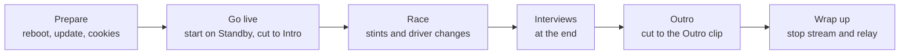
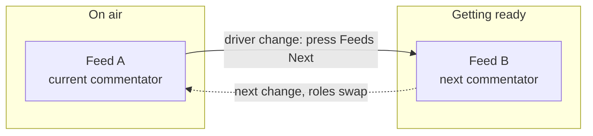

# Run an event

The producer's checklist from go-live to wrap. Assumes the machine is already set up —
if not, do [Set up the broadcast PC](Set-up-the-broadcast-PC) first.

## The shape of an event

## One-command bring-up

On the event day, start everything with:

    iro event start

This launches Tailscale, Discord, the relay, OBS and Companion (in that
order) and ends with a readiness report. Re-check any time with
`iro event status` — it verifies the apps and services are running and that
cookies, graphics and the intro/outro clips are present, and names the exact
fix command for anything missing.

> **Page updates:** `iro event start` re-loads the HUD/timer browser sources
> automatically when an update changed them. If a page ever looks stale,
> `iro obs refresh` (or right-click the source → Refresh) forces it.

After the broadcast, `iro event stop` stops the relay and Companion; OBS,
Discord and Tailscale stay running. If OBS is still open, the stop also asks
it (via the OBS WebSocket, port 4455) to drop its connections to the dead
feeds — otherwise OBS would pin the feed ports until it restarts and the next
preflight would warn "port in use". The feed sources reconnect automatically
the next time their scene goes active.

## Before you go live

1. **Update the tool:** `iro update` — picks up the latest release (skip if the team froze the version for the event).
2. **Reboot** the PC (frees memory) and close heavy apps.
3. **Update the tools:** `iro install-tools --update`. Outdated tools are the #1
   cause of a feed not starting. (Manual alternative: `brew upgrade streamlink yt-dlp`
   on macOS/Linux · `winget upgrade yt-dlp.yt-dlp Streamlink.Streamlink` on Windows.)
4. **Refresh cookies:** `iro cookies firefox` (log into YouTube in Firefox first).
5. **Refresh the intro/outro clips** (only if their URLs changed):
   `iro media` — pulls the URLs from the Sheet **Assets** tab and
   downloads `runtime/media/intro.mp4` / `outro.mp4`.
6. **Refresh the graphics:** `iro graphics` — pulls every graphic from
   the Sheet **Assets** tab into `runtime/graphics/` (Standings, Schedule, Race/Quali
   Results, the three weather overlays, Standby, …). Run it whenever the sheet graphics
   changed. The **weather** graphics are then available as full-screen toggles during the
   race (see [Director guide](Director)).
7. **Pre-flight check:** `iro preflight` — fix anything it flags.
8. **Start the feeds and apps:** `iro event start` brings up Tailscale, Discord,
   the relay, OBS and Companion in one go. If Tailscale's backend is stopped,
   `event start` connects it automatically — no click in the Tailscale GUI needed.
   Alternatively, start them individually: `iro relay start` then `iro companion
   start`. Confirm each live feed shows up in OBS.
9. Make sure **Companion** is connected (green) and a director can reach
   `http://<producer-tailscale-ip>:8000/tablet`.
10. **Enter the IRO stream key** in OBS (**Settings → Stream**).

## Go live

Start OBS on the **Standby** scene, then click **Start Streaming**. From here the
**director runs the show** — you just keep an eye on the machine. The director opens with
the **Intro**: pressing **INTRO** (Companion) plays the looping intro clip with its own
audio. When the field is ready they cut into the race look (**STINT A** / **Splitscreen**).

## The director panel (remote control)

Directors without a Stream Deck — or anyone on a tablet — can drive the same
show from the **director panel** the relay serves at
`http://<producer-tailscale-ip>:8088/panel` (`iro event start` prints the
URL — just forward it).

The page is organized as horizontal busses that mirror the Companion pages,
so the Stream Deck and the panel share one muscle memory:

| Bus | What it does |
|---|---|
| **PGM** | one-press program switches (scene + feed visibility + mutes), identical to the Companion macros — STINT A/B, SPLIT, INTERVIEW, STANDBY, INTRO, OUTRO, RED FLAG. SPLIT also sets Race Control to *Driver Swaps*, STINT A/B clear it, and RED FLAG toggles the Standby Cover together with the *Red Flag* message ([Director guide](Director#the-button-board)); these Race Control writes need the sheet-write webhook |
| **FEEDS** | relay control: NEXT (driver change), feed reloads, POV reload/stop, SET STINT… |
| **HUD** | the Sheet's Setup-tab dropdowns (Stint HUD label, Streamer, Session, Race Control) — changes show on the HUD immediately and are written to the Sheet ([Director guide](Director)) |
| **SCN·VIS** | raw scene switches and feed visibility toggles |
| **GFX** | graphics toggles (HUD, Standings, Schedule, results, weather, covers) |
| **TIMER** | the race timer (see [Race Timer](Race-Timer)) |
| **AUDIO** | per-input dB sliders, 0 dB reset and mutes |
| **URLs** | collapsible editor for the Schedule tab (per-stint name + URL, rows live on a feed are marked A/B) and the POV URL — saves write the Sheet only; feeds pick changes up on RELOAD/NEXT |

The status strip at the top shows what is on air, which stint each feed
carries, the POV state and the race timer. **FEEDS, TIMER, HUD and URLs
work relay-only** — no OBS connection needed (HUD and URLs additionally
need the sheet-write webhook, see [Sheet-Webhook](Sheet-Webhook); without it
they are display-only). Everything else needs the OBS WebSocket connection:
the producer's Tailscale IP, port `4455`, and the password from OBS → Tools →
WebSocket Server Settings.

## During the race: driver changes

About every two hours the driver/commentator changes. Two feeds take turns so the picture
on air never drops:

At each change the director: cuts to **Splitscreen** (the combo sets **Race Control** to
*Driver Swaps* with it), presses **Feeds Next**, updates the **Stint** and **Streamer**
cells, then cuts back with **STINT A** / **STINT B** (the incoming feed) — which also
clears **Race Control**.
The panel's **HUD row** provides the same Stint / Streamer / Race Control dropdowns
directly — editing the sheet and using the panel are equivalent.
Full step-by-step: [Director guide](Director#at-a-driver-change). (Why two feeds:
[Relay — how the feeds work](Relay-Mode).)

## During the race: driver POV (optional)

The director can show a driver's stream as a small PiP in the Stint scene. It needs a
**few minutes of lead time** — the driver goes live, the URL goes into the sheet, the
director presses **POV Reload**, and only once the relay reports the pull as `serving`
is there a picture to show. The director drives all of it; on the producer side nothing
is needed beyond the relay already running. Steps and timing:
[Director guide](Director#showing-a-driver-pov-plan-ahead).

## Producer handover (12h/24h multi-part events)

Long events are split into broadcast parts run by different producers, each on
their own machine with their own stream key. Viewers follow via the channel's
end-of-stream redirect; plan a few minutes of deliberate overlap.

The relay does **not** need the previous producer's Feed A/B order — the
ping-pong works from any starting point. `--stint <N>` simply puts stint N on
Feed A and preloads stint N+1 on Feed B; from there `/next` works as usual.
Which feed carries which stint may therefore differ between the parts — that
is fine.

1. Incoming producer: `iro event start --stint <N>` — N is the stint **on air
   right now** (1-based, from the schedule sheet / Discord). Taking over right
   at a stint change (e.g. a part boundary like "end of stint 3"): pass the
   stint that is starting.
2. Verify Feed A shows the expected commentator (`/status` or the OBS
   preview).
3. Start your OBS stream with this part's stream key — the overlap begins.
4. Share your panel/tablet URLs with the directors (`iro event start` prints
   them — just forward).
5. Outgoing producer: stop the stream (the YouTube redirect takes over), then
   `iro event stop`.

Typo, or forgot `--stint`? Fix it **before going live**:
`http://127.0.0.1:8088/set/stint/<N>` repositions both feeds. Like the other
`/set` endpoints it tears a running feed off its stream — not for mid-program
use.

**Same producer runs the next part:** just stop the OBS stream and start it
again with the next part's stream key — the relay keeps running, no `--stint`
needed.

## Interviews (at the end)

Interviews run at the very end over Discord voice. The producer who is on air for the last
part must **join the Discord "Interviews" voice channel personally, before race end** — the
OBS audio is captured from your local Discord, so the director can't join for you. You stay
muted until the director cuts to the Interview scene, so joining early is harmless. (On
12 h / 24 h events only the final-part producer does this.)

The conversation itself is moderated from **inside the voice channel** by one of its
participants — usually the streamer of the final stint. The director can take that
role, but does not have to.

## Outro &amp; wrap up

When the interviews and the on-air wrap-up are done, the director presses **OUTRO** — the
looping outro clip plays (with its own audio) and stays on air. After that you can **Stop
Streaming** in OBS at any time, then stop the feeds (Ctrl+C the relay).

---

Something looks wrong? → [If something goes wrong](If-something-goes-wrong).
