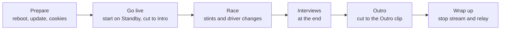
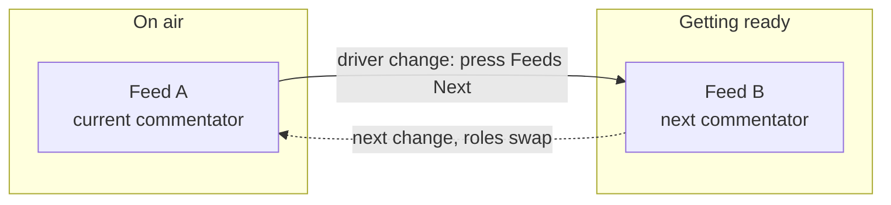

# Run an event

The producer's checklist from go-live to wrap. Assumes the machine is already set up —
if not, do [Set up the broadcast PC](Set-up-the-broadcast-PC) first.

## The shape of an event

## Before you go live

1. **Reboot** the PC (frees memory) and close heavy apps.
2. **Update the tools:** macOS/Linux `brew upgrade streamlink yt-dlp` · Windows
   `winget upgrade yt-dlp.yt-dlp Streamlink.Streamlink`. Outdated tools are the #1
   cause of a feed not starting.
3. **Refresh cookies:** `iro cookies firefox` (log into YouTube in Firefox first).
4. **Refresh the intro/outro clips** (only if their URLs changed):
   `iro media` — pulls the URLs from the Sheet **Assets** tab and
   downloads `runtime/media/intro.mp4` / `outro.mp4`.
5. **Refresh the graphics:** `iro graphics` — pulls every graphic from
   the Sheet **Assets** tab into `runtime/graphics/` (Standings, Schedule, Race/Quali
   Results, the three weather overlays, Standby, …). Run it whenever the sheet graphics
   changed. The **weather** graphics are then available as full-screen toggles during the
   race (see [Director guide](Director)).
6. **Pre-flight check:** `iro preflight` — fix anything it flags.
7. **Start the feeds:** `iro relay start`. Confirm each live feed shows up in
   OBS.
8. Make sure **Companion** is connected (green) and a director can reach
   `http://<producer-tailscale-ip>:8000/tablet`.
9. **Enter the IRO stream key** in OBS (**Settings → Stream**).

## Go live

Start OBS on the **Standby** scene, then click **Start Streaming**. From here the
**director runs the show** — you just keep an eye on the machine. The director opens with
the **Intro**: pressing **INTRO** (Companion) plays the looping intro clip with its own
audio. When the field is ready they cut into the race look (**STINT A** / **Splitscreen**).

## During the race: driver changes

About every two hours the driver/commentator changes. Two feeds take turns so the picture
on air never drops:

At each change the director: cuts to **Splitscreen**, sets **Race Control** to *Driver
Swaps* in the sheet, presses **Feeds Next**, updates the **Stint** and **Streamer** cells,
cuts back with **STINT A** / **STINT B** (the incoming feed), then clears **Race Control**.
Full step-by-step: [Director guide](Director#at-a-driver-change). (Why two feeds:
[Relay — how the feeds work](Relay-Mode).)

## Interviews (at the end)

Interviews run at the very end over Discord voice. The producer who is on air for the last
part must **join the Discord "Interviews" voice channel personally, before race end** — the
OBS audio is captured from your local Discord, so the director can't join for you. You stay
muted until the director cuts to the Interview scene, so joining early is harmless. (On
12 h / 24 h events only the final-part producer does this.)

## Outro &amp; wrap up

When the interviews and the on-air wrap-up are done, the director presses **OUTRO** — the
looping outro clip plays (with its own audio) and stays on air. After that you can **Stop
Streaming** in OBS at any time, then stop the feeds (Ctrl+C the relay).

---

Something looks wrong? → [If something goes wrong](If-something-goes-wrong).
