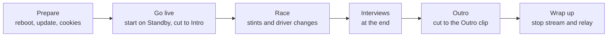
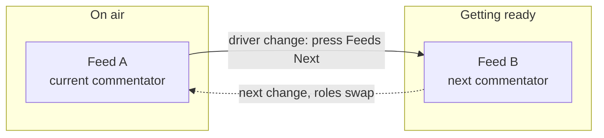

# Run an event

The producer's checklist from go-live to wrap. Assumes the machine is already set up —
if not, do [Set up the broadcast PC](Set-up-the-broadcast-PC) first.

## The shape of an event

## One-click bring-up

On the event day, open the **[Control Center](Control-Center)** (double-click
`racecast-ui`), confirm the **active league profile** in the sidebar (switch in the
**Profile** view if you run several leagues), and press **Start event** on the **Home**
dashboard.

This launches Tailscale, Discord, the relay, OBS and Companion (in that order).
The dashboard then shows each one's state at a glance, plus tiles for Preflight,
Assets and Cookies readiness — so you can see what's still missing and fix it from
the matching view.

> **Page updates:** starting the event re-loads the HUD/timer browser sources
> automatically when an update changed them. If a page ever looks stale,
> `racecast obs refresh` (or right-click the source → Refresh) forces it.

After the broadcast, press **Stop event** — it stops the relay and Companion;
OBS, Discord and Tailscale stay running. If OBS is still open, the stop also asks
it (via the OBS WebSocket, port 4455) to drop its connections to the dead feeds —
otherwise OBS would pin the feed ports until it restarts and the next preflight
would warn "port in use". The feed sources reconnect automatically the next time
their scene goes active.

> **CLI alternative:** `racecast event start` (bring-up), `racecast event status`
> (readiness report — names the exact fix command for anything missing),
> `racecast event stop` (wind-down). All act on the active league profile; run one
> against another league with `racecast --profile <name> event …`.

## Before you go live

Plan **about 30 minutes** for these steps before the broadcast slot. Do them from
the Control Center; the CLI alternative is in italics.

1. **Pick the league.** Confirm the active league in the sidebar; if this machine
   serves several leagues, switch in the **Profile** view. Every following step acts
   on the active league. *CLI: `racecast profile use <name>`.*
2. **Update the tool.** The Control Center flags an available update in the
   sidebar. Apply it (skip if the team froze the version for the event).
   *CLI: `racecast update`.*
3. **Reboot** the PC (frees memory) and close heavy apps.
4. **Tools → Update all.** Outdated tools are the #1 cause of a feed not starting.
   *CLI: `racecast install-tools --update`* (manual: `brew upgrade streamlink yt-dlp` on
   macOS/Linux · `winget upgrade yt-dlp.yt-dlp Streamlink.Streamlink` on Windows).
5. **Assets → Cookies → Refresh** (pick the browser; log into YouTube in it first).
   If any stint uses a gated Twitch feed, also refresh the Twitch login:
   *CLI: `racecast cookies firefox` (YouTube, required) and
   `racecast cookies twitch firefox` (Twitch, if needed).*
6. **Refresh the intro/outro clips** (only if their URLs changed): **Assets →
   Media → Download** — pulls the URLs from the Sheet **Assets** tab into the active
   profile's `runtime/<profile>/media/intro.mp4` / `outro.mp4`. *CLI: `racecast media`.*
7. **Refresh the graphics:** **Assets → Graphics → Download** — pulls every graphic
   from the Sheet **Assets** tab into the active profile's `runtime/<profile>/graphics/`
   (Standings, Schedule, Race/Quali Results, the three weather overlays, Standby, …). Run
   it whenever the sheet graphics changed. The **weather** graphics are then available as
   full-screen toggles during the race (see [Director guide](Director)). *CLI: `racecast graphics`.*
8. **Preflight → Run** — fix anything it flags. *CLI: `racecast preflight`.*
9. **Home → Start event** brings up Tailscale, Discord, the relay, OBS and
   Companion in one go. If Tailscale's backend is stopped, this connects it
   automatically — no click in the Tailscale GUI needed. (Or start them individually
   from **Relay** and **Apps**.) Confirm each live feed shows up in OBS. *CLI:
   `racecast event start`, or `racecast relay start` then `racecast companion start`.*
10. On the **Home** dashboard, make sure **Companion** is connected and a director
   can reach `http://<producer-tailscale-ip>:8000/tablet` (first-time directors:
   [Director setup](Director-Setup)).
11. **Enter the league's stream key** in OBS (**Settings → Stream**).

## Go live

Start OBS on the **Standby** scene, then click **Start Streaming**. From here the
**director runs the show** — you just keep an eye on the machine. The director opens with
the **Intro**: pressing **INTRO** (Companion) plays the looping intro clip with its own
audio. When the field is ready they cut into the race look (**STINT A** / **Splitscreen**).

**You should now see:** OBS sitting on **Standby** with the stream running —
the **Start Streaming** button now reads **Stop Streaming**.
<!-- screenshot: OBS on Standby with the stream running (button reads Stop Streaming) -->

## The director panel (remote control)

Directors without a Stream Deck — or anyone on a tablet — can drive the same
show from the **director panel** the relay serves at
`http://<producer-tailscale-ip>:8088/panel` (`racecast event start` prints both
director URLs ready to forward; first-time directors:
[Director setup](Director-Setup)).

The page is organized as horizontal busses that mirror the Companion pages,
so the Stream Deck and the panel share one muscle memory:

| Bus | What it does |
|---|---|
| **PGM** | one-press program switches (scene + feed visibility + mutes), identical to the Companion macros — STINT A/B, SPLIT, INTERVIEW, STANDBY, INTRO, OUTRO, RED FLAG. SPLIT also sets Race Control to *Driver Swaps*, STINT A/B clear it, and RED FLAG toggles the Standby Cover together with the *Red Flag* message ([Director guide](Director#the-companion-button-board)); these Race Control writes need the sheet-write webhook |
| **FEEDS** | relay control: NEXT (driver change — cuts back to Stint and clears Race Control with the cut), feed reloads, POV reload/stop, FEEDS → STINT… |
| **HUD** | the Sheet's Setup-tab dropdowns (Stint HUD label, Streamer, Session, Race Control) — changes show on the HUD immediately and are written to the Sheet ([Director guide](Director)) |
| **SCN·VIS** | raw scene switches and feed visibility toggles |
| **GFX** | graphics toggles (HUD, Standings, Schedule, results, weather, covers) |
| **TIMER** | the race timer (see [Race Timer](Race-Timer)) |
| **AUDIO** | per-input dB sliders, 0 dB reset and mutes |
| **URLs** | collapsible editor for the Schedule tab (per-stint Streamer + Stint label dropdowns + URL, rows live on a feed are marked A/B) and the POV URL — saves write the Sheet only; feeds pick changes up on RELOAD/NEXT. On handover the on-air row's Streamer + Stint label auto-fill the HUD |

The status strip at the top shows what is on air, which stint each feed
carries, the POV state and the race timer. **FEEDS, TIMER, HUD and URLs
work relay-only** — no OBS connection needed (HUD and URLs additionally
need the sheet-write webhook, see [Sheet-Webhook](Sheet-Webhook); without it
they are display-only). Everything else needs the OBS WebSocket connection:
the producer's Tailscale IP, port `4455`, and the password from OBS → Tools →
WebSocket Server Settings.

## During the race: driver changes

About every two hours the driver/commentator changes. Two feeds take turns so the picture
on air never drops:

At each change the director: cuts to **Splitscreen** (the combo sets **Race Control** to
*Driver Swaps* with it), then presses **Feeds Next** — the relay hands the feed over and
cuts the program back to **Stint** on the incoming feed for you (no **STINT A/B** press
needed), **clearing Race Control** with the cut — and sets the HUD's **Stint**
label and **Streamer** from the on-air **Schedule row** automatically (sourced
from the Configuration vocab; a blank or off-vocab row leaves the field as-is).
The panel's **HUD row** still provides the Stint / Streamer / Race Control dropdowns
directly as a live correction — editing the sheet and using the panel are equivalent,
and the next handover re-asserts the schedule's values.
Full step-by-step: [Director guide](Director#at-a-driver-change). (Why two feeds:
[Relay — how the feeds work](Relay-Mode).)

## During the race: driver POV (optional)

The director can show a driver's stream as a small PiP in the Stint scene. It needs a
**few minutes of lead time** — the driver goes live, the URL goes into the sheet, the
director presses **POV Reload**, and only once the relay reports the pull as `serving`
is there a picture to show. The director drives all of it; on the producer side nothing
is needed beyond the relay already running. Steps and timing:
[Director guide](Director#showing-a-driver-pov-plan-ahead).

## Producer handover (12h/24h multi-part events)

Long events are split into broadcast parts run by different producers, each on
their own machine with their own stream key. Viewers follow via the channel's
end-of-stream redirect; plan a few minutes of deliberate overlap.

The relay does **not** need the previous producer's Feed A/B order — the
ping-pong works from any starting point. `--stint <N>` simply puts stint N on
Feed A and preloads stint N+1 on Feed B; from there `/next` works as usual.
Which feed carries which stint may therefore differ between the parts — that
is fine.

1. Incoming producer: on the Control Center **Home**, type the stint into the
   field next to **Start event** and press it (*CLI: `racecast event start --stint <N>`*).
   N is the stint **on air right now** (1-based, from the schedule sheet / Discord).
   The **outgoing producer's** panel status strip (or their `/status`) shows the
   stint each feed carries and which is on air — anyone with that panel open can
   read N off it. Taking over right at a stint change (e.g. a part boundary like
   "end of stint 3"): pass the stint that is starting.
2. Verify Feed A shows the expected commentator (`/status` or the OBS
   preview).
3. Start your OBS stream with this part's stream key — the overlap begins.
4. Share your panel/tablet URLs with the directors (`racecast event start` prints
   them — just forward).
5. Outgoing producer: stop the stream (the YouTube redirect takes over), then
   `racecast event stop`.

Typo, or forgot `--stint`? Fix it **before going live**:
`http://127.0.0.1:8088/set/stint/<N>` repositions both feeds. Like the other
`/set` endpoints it tears a running feed off its stream — not for mid-program
use.

**Same producer runs the next part:** just stop the OBS stream and start it
again with the next part's stream key — the relay keeps running, no `--stint`
needed.

## Interviews (at the end)

Interviews run at the very end over Discord voice. The producer who is on air for the last
part must **join the Discord "Interviews" voice channel personally, before race end** — the
OBS audio is captured from your local Discord, so the director can't join for you. You stay
muted until the director cuts to the Interview scene, so joining early is harmless. (On
12 h / 24 h events only the final-part producer does this.)

The conversation itself is moderated from **inside the voice channel** by one of its
participants — usually the streamer of the final stint. The director can take that
role, but does not have to.

## Outro &amp; wrap up

When the interviews and the on-air wrap-up are done, the director presses **OUTRO** — the
looping outro clip plays (with its own audio) and stays on air. After that you can **Stop
Streaming** in OBS at any time, then stop the feeds (Ctrl+C the relay).

---

Something looks wrong? → [If something goes wrong](If-something-goes-wrong).
