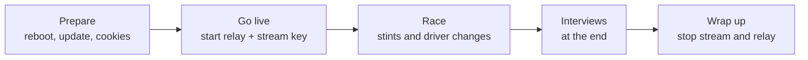
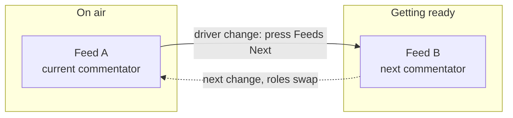

# Run an event

The producer's checklist from go-live to wrap. Assumes the machine is already set up —
if not, do [Set up the broadcast PC](Set-up-the-broadcast-PC) first.

## The shape of an event

## Before you go live

1. **Reboot** the PC (frees memory) and close heavy apps.
2. **Update the tools:** macOS/Linux `brew upgrade streamlink yt-dlp` · Windows
   `pip install -U streamlink yt-dlp`. Outdated tools are the #1 cause of a feed not
   starting.
3. **Refresh cookies:** `python3 src/relay/get-cookies.py chrome` (any logged-in browser).
4. **Pre-flight check:** `python3 src/scripts/preflight.py` — fix anything it flags.
5. **Start the feeds:** `python3 tools/run-relay.py`. Confirm each live feed shows up in
   OBS.
6. Make sure **Companion** is connected (green) and a director can reach
   `http://<producer-tailscale-ip>:8000/tablet`.
7. **Enter the IRO stream key** in OBS (**Settings → Stream**).

## Go live

Click **Start Streaming** in OBS. From here the **director runs the show** — you just keep
an eye on the machine.

## During the race: driver changes

About every two hours the driver/commentator changes. Two feeds take turns so the picture
on air never drops:

At each change the director: cuts to **Splitscreen**, sets **Race Control** to *Driver
Swaps* in the sheet, presses **Feeds Next**, updates the **Stint** and **Streamer** cells,
cuts back with **STINT A** / **STINT B** (the incoming feed), then clears **Race Control**.
Full step-by-step: [Director guide](Director#at-a-driver-change). (Why two feeds:
[Relay — how the feeds work](Relay-Mode).)

## Interviews (at the end)

Interviews run at the very end over Discord voice. The producer who is on air for the last
part must **join the Discord "Interviews" voice channel personally, before race end** — the
OBS audio is captured from your local Discord, so the director can't join for you. You stay
muted until the director cuts to the Interview scene, so joining early is harmless. (On
12 h / 24 h events only the final-part producer does this.)

## Wrap up

Click **Stop Streaming** in OBS, then stop the feeds (Ctrl+C the relay).

---

Something looks wrong? → [If something goes wrong](If-something-goes-wrong).
