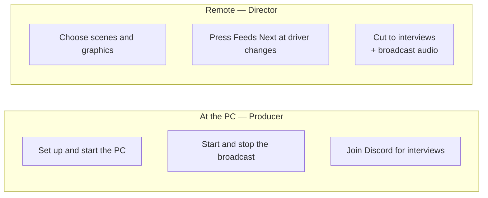

# Who does what

Three groups make the show happen: the **commentators** who stream each stint, the
**producer** at the PC, and the **director** who chooses what viewers see.

## Producer (at the PC)

- Sets the machine up and keeps it healthy — see [Set up the broadcast PC](Set-up-the-broadcast-PC).
- **Starts and stops** the broadcast; everything in between is the director's job.
- Joins the Discord "Interviews" voice channel for the interview segment (last-part
  producer only — see below).
- Keeps the shared Google Sheet intact.

## Director (remote)

- Drives the whole show from a browser (panel or Companion buttons) — no
  machine access. First time: [Director setup](Director-Setup); then the
  [Director guide](Director).
- Chooses scenes and graphics, presses **Feeds Next** at each driver change, and cuts
  to the interview segment (scene + broadcast audio). The interview conversation itself
  is moderated from inside the Discord voice channel by one of its participants —
  usually the final-stint streamer; the director can take that role but doesn't have to.
- Multiple directors can take turns; the producer can also direct locally.

## Commentators / streamers

Each stint's commentator streams the race on **their own channel**. Hand them this:

- **Platform:** your own YouTube (or Twitch), set to **Unlisted**, the **same channel**
  every event.
- **Latency:** **Low** (not Ultra-low) — buffering protection lives on the producer side.
- **Resolution:** **1080p** target; if your upload can't hold ~6 Mbps drop to **720p — never
  below**.
- **Bitrate (CBR), 2 s keyframes:** 1080p60 ≈ 8000 · 1080p30 ≈ 6000 · 720p60 ≈ 4500 ·
  720p30 ≈ 3000 kbps. Audio 128–160 kbps AAC.
- **Encoder:** hardware (NVENC / QuickSync / AMF). **No personal overlays** — graphics are
  added centrally.
- **Send your watch link** before your stint for the schedule:
  YouTube: `https://www.youtube.com/watch?v=…` ·
  Twitch: `https://www.twitch.tv/<your-channel>`. Post it in the crew **Discord** channel —
  the producer/director enters it into the sheet.

### Streaming straight from a PlayStation (no PC)

You can broadcast directly from the console — the relay pulls it the same way:

- **PS5:** 1080p60 to YouTube or Twitch, and you can pick **Unlisted** right on the
  console. This meets the targets above on its own.
- **PS4:** **PS4 Pro** can reach 1080p; the **base PS4** tops out at **720p** — still fine
  (never below 720p). Unlisted works here too.
- **Latency — set it up once, beforehand.** The console has **no latency control**, so the
  PS default (Normal, 15–60 s) is too slow for handover. Fix it ahead of the event on the
  channel itself, *not* at stream time:
  - **YouTube:** YouTube Studio → Settings → set stream latency to **Low**.
  - **Twitch:** Creator Dashboard → Stream → keep **Low Latency** mode on (it is the
    default).
- **No CBR/keyframe/encoder knobs** on the console — that is handled for you; just set the
  resolution and the privacy/latency above.

## Event sizes

- **8 h** = 1 part = 1 producer (also the one who joins Discord for the interviews).
- **12 h** = 2 parts (~6 h each) = 2 producers.
- **24 h** = 3 parts = 3 producers.

Only the **last-part** producer joins Discord; earlier producers don't use Discord at all.

> The HUD and graphics pull live data from the **shared Google Sheet**. The race timer is
> relay-served; Director controls (start/stop/show/hide/correct) are on the panel's Race
> Timer section and Companion page 2 — see [Race-Timer](Race-Timer). Changes to shared
> resources affect everyone, and the sheet must stay shared. The details are in
> [Configuration & secrets](Configuration).
