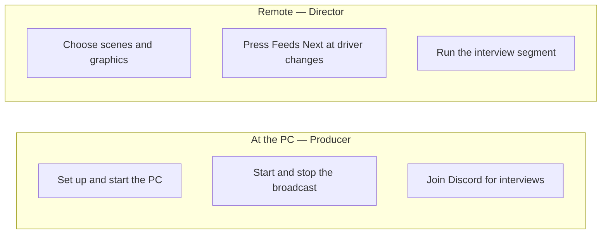

# Who does what

Three groups make the show happen: the **commentators** who stream each stint, the
**producer** at the PC, and the **director** who chooses what viewers see.

## Producer (at the PC)

- Sets the machine up and keeps it healthy — see [Set up the broadcast PC](Set-up-the-broadcast-PC).
- **Starts and stops** the broadcast; everything in between is the director's job.
- Joins the Discord "Interviews" voice channel for the interview segment (last-part
  producer only — see below).
- Keeps the shared Google Sheet intact.

## Director (remote)

- Drives the whole show from a browser via Companion — no machine access. See
  [Director guide](Director).
- Chooses scenes and graphics, presses **Feeds Next** at each driver change, and runs the
  interviews.
- Multiple directors can take turns; the producer can also direct locally.

## Commentators / streamers

Each stint's commentator streams the race on **their own channel**. Hand them this:

- **Platform:** your own YouTube (or Twitch), set to **Unlisted**, the **same channel**
  every event.
- **Latency:** **Low** (not Ultra-low) — buffering protection lives on the producer side.
- **Resolution:** **1080p** target; if your upload can't hold ~6 Mbps drop to **720p — never
  below**.
- **Bitrate (CBR), 2 s keyframes:** 1080p60 ≈ 8000 · 1080p30 ≈ 6000 · 720p60 ≈ 4500 ·
  720p30 ≈ 3000 kbps. Audio 128–160 kbps AAC.
- **Encoder:** hardware (NVENC / QuickSync / AMF). **No personal overlays** — graphics are
  added centrally.
- **Send your watch link** before your stint (`https://www.youtube.com/watch?v=…`) for the
  schedule.

## Event sizes

- **8 h** = 1 part = 1 producer (always runs the interviews).
- **12 h** = 2 parts (~6 h each) = 2 producers.
- **24 h** = 3 parts = 3 producers.

Only the **last-part** producer joins Discord; earlier producers don't use Discord at all.

> The HUD and graphics pull live data from the **shared Google Sheet**. The race timer is
> relay-served; Director controls (start/stop/show/hide/correct) are on the panel's Race
> Timer section and Companion page 2 — see [Race-Timer](Race-Timer). Changes to shared
> resources affect everyone, and the sheet must stay shared. The details are in
> [Configuration & secrets](Configuration).
